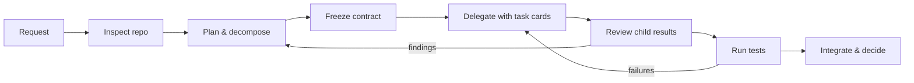
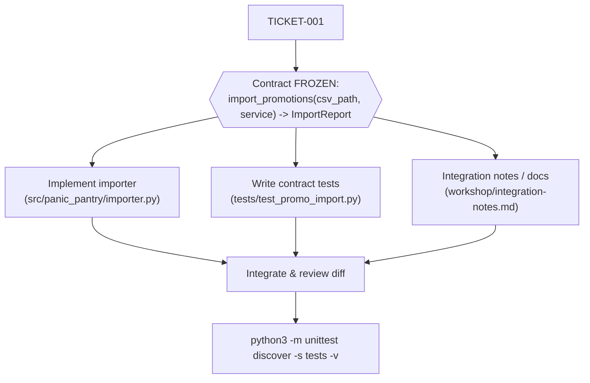
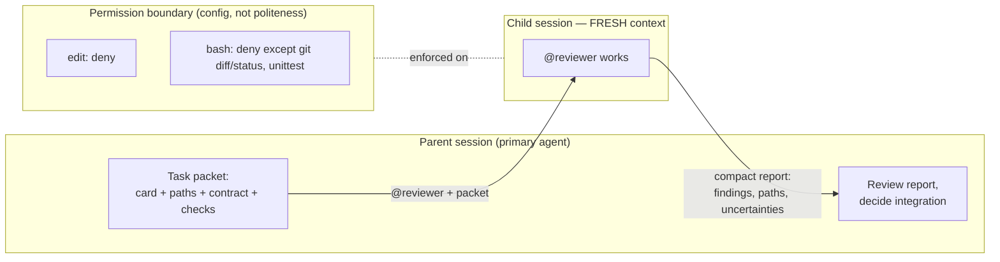
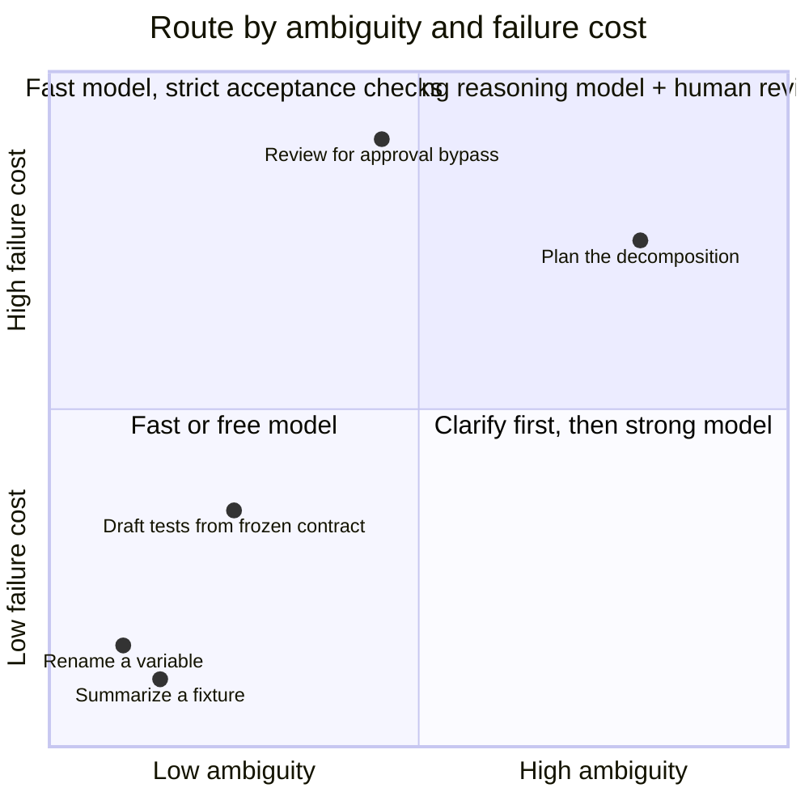

# Orchestration Fundamentals for Agentic Development — Student Handout

**Tool:** OpenCode **1.18.33** (your instructor pinned this version; every command and config example in this handout was verified 2026-09-28 on OpenCode 1.18.33).
**Sandbox:** the Panic Pantry snack shop in [sandbox/panic-pantry](sandbox/panic-pantry/README.md). Pure Python 3 standard library. Everything runs offline.
**Promise:** you leave having decomposed, delegated, run, reviewed, and integrated a real feature with OpenCode — not having watched someone talk about agents.

---

## The story you are walking into

Panic Pantry is a tiny late-night snack shop preparing the **Midnight Crunch Drop**. Marketing will hand over a CSV of promo codes minutes before launch. The shop already has one hard rule, enforced in code and written on the wall:

> **Discounts above 20% require manager approval.** A promo of exactly 20% is fine and becomes active. A promo of 21% or more is stored as `pending_approval` and cannot be applied at checkout until a human manager approves it.

The nightmare scenario: someone imports `FREE-ALL,100`, the importer skips the approval rule, a customer pays nothing, and the shop ships a truckload of pretzels into bankruptcy. Your job all afternoon is to build the importer *without* letting any agent — fast, clever, or free — bypass that rule.

One incident, four hours, every orchestration skill you need at work.

---

## Schedule (240 minutes total, 183 hands-on)

| Time | Min | Type | Segment |
|---|---:|---|---|
| 0:00–0:07 | 7 | Lecture | Opening — more agents ≠ more progress |
| 0:07–0:32 | 25 | **Hands-on** | Exercise 0 — the vague ticket + single-agent baseline |
| 0:32–0:38 | 6 | Lecture | Micro-lecture 1 — turn a wish into a ticket |
| 0:38–1:08 | 30 | **Hands-on** | Exercise 1 — task surgery |
| 1:08–1:18 | 10 | Break | |
| 1:18–1:24 | 6 | Lecture | Micro-lecture 2 — a role is a boundary |
| 1:24–1:56 | 32 | **Hands-on** | Exercise 2 — build a small agent crew |
| 1:56–2:02 | 6 | Lecture | Micro-lecture 3 — model choice is a budget decision |
| 2:02–2:34 | 32 | **Hands-on** | Exercise 3 — model routing |
| 2:34–2:39 | 5 | Break | |
| 2:39–2:45 | 6 | Lecture | Micro-lecture 4 — parallelism is a dependency claim |
| 2:45–3:22 | 37 | **Hands-on** | Exercise 4 — orchestrated run + matched comparison |
| 3:22–3:28 | 6 | Lecture | Micro-lecture 5 — a green check is evidence, not a handoff |
| 3:28–3:55 | 27 | **Hands-on** | Capstone — midnight launch |
| 3:55–4:00 | 5 | Close | Exit ticket |

**Arithmetic check:** hands-on = 25 + 30 + 32 + 32 + 37 + 27 = **183 min**. Lecture = 7 + 6 + 6 + 6 + 6 + 6 = 37. Breaks = 10 + 5 = 15. Close = 5. Total = 183 + 37 + 15 + 5 = **240 min**. ✔

---

## One-time setup (instructor runs this before class; you verify)

From the pack root:

```bash
bash sandbox/setup.sh
```

This makes `sandbox/panic-pantry` a git repo, tags the starter commit `starter`, and creates two matched worktrees at the **same commit**:

- `sandbox/worktrees/single-agent` — Exercise 0 baseline
- `sandbox/worktrees/orchestrated` — Exercise 4 orchestrated run

> ⚠️ **Re-running `bash sandbox/setup.sh` DISCARDS all changes inside both worktrees.** Only re-run it when you deliberately want a fresh comparison.

Verify your environment (from `sandbox/panic-pantry`):

```bash
bash scripts/check_env.sh
```

Expected: python3 and git versions print, `opencode --version` prints `1.18.33`, and the test suite ends with `OK (skipped=9)` — 23 tests, 9 skipped. The 9 skips are the importer acceptance tests waiting for a file you have not written yet. They are the finish line, not a problem.

Reset the sandbox anytime with:

```bash
bash scripts/reset.sh
```

**File ownership manifest:** [workshop/WRITABLE_FILES.md](sandbox/panic-pantry/workshop/WRITABLE_FILES.md) lists exactly what you (and your agents) may edit per exercise. Treat it as law.

**Project rules for agents:** [AGENTS.md](sandbox/panic-pantry/AGENTS.md) at the repo root is read automatically by OpenCode as project rules — no prompt needed ([docs: rules](https://opencode.ai/docs/rules), verified 2026-09-28 on OpenCode 1.18.33). `/init` can generate one; ours already exists. OpenAI's harness-engineering write-up recommends keeping this file a ~100-line table of contents and enforcing the real rules mechanically with tests — which is exactly how this sandbox is built ([OpenAI: Harness Engineering](https://openai.com/index/harness-engineering/), Feb 2026).

> **One-time version note:** OpenCode V2 exists and renames some vocabulary (`permissions`, `shell`, `subagent`). This class uses **V1 syntax only**, matching the pinned 1.18.33 binary. If a doc page or blog snippet looks different from this handout, check which major version it targets before trusting it.

---

## Opening — More agents do not automatically mean more progress

The release is at midnight. The discount code is `FREE-ALL`. The shop is out of pretzels and, somehow, in debt.

**Claim: agents multiply the quality of your plan — including a bad one.** One agent given a vague request makes vague guesses. Five agents given a vague request make five *different* vague guesses, concurrently, in your codebase. Anthropic's multi-agent research system showed real wins on parallelizable research tasks, but at roughly 15× the tokens of a chat session, and they note that coding has fewer truly parallelizable tasks than research does ([Anthropic: How We Built Our Multi-Agent Research System](https://www.anthropic.com/engineering/multi-agent-research-system), Jun 2025 — their system, not a universal constant).

Your role today is **release lead**: the person who turns "add an importer" into commissioned, checkable work — and who owns the integrated result. Think of a restaurant pass: many stations, one ticket, one person who decides what actually goes out the door.



*Figure 1: The orchestration loop you will run all afternoon.*
Text alternative: a cycle — request, inspect the repo, plan and decompose, freeze the contract, delegate with task cards, review child results, run tests, integrate and decide; review findings loop back to planning, test failures loop back to delegation.

---

## Exercise 0 — The vague ticket (25 min) 🔨

**Goal:** feel the gap between "ask for a feature" and "commission a task," then produce a single-agent baseline you will compare against in Exercise 4.

**Starting checkpoint:**

```bash
cd sandbox/worktrees/single-agent
git status                                   # clean, branch single-agent
python3 -m unittest discover -s tests -v     # ends OK (skipped=9)
opencode                                     # start OpenCode in this directory
```

### Part A — Ask for a plan, not a patch (~6 min)

In OpenCode, press **Tab** to switch to the **Plan** primary agent (Tab toggles Build/Plan; in Plan, edits require approval (ask) — verified 2026-09-28 on OpenCode 1.18.33, [docs: agents](https://opencode.ai/docs/agents)). Paste exactly:

```text
Add a CSV importer for promo codes. Show me your plan first. Do not edit any files.
```

Read the plan skeptically. In your notes, record:

- Every **assumption** the agent made (columns? duplicates? errors? file location?)
- Every **policy** it did or did not mention
- Every **interface** it guessed at
- What "done" would even mean under this plan

### Part B — Find the real rules (~4 min)

Inspect the repo yourself — the authoritative sources, not the agent's summary:

```bash
cat AGENTS.md
cat tickets/TICKET-001.md
sed -n '1,30p' src/panic_pantry/promotions.py
```

Find the policy: **above 20% requires approval; exactly 20% is active.** Note where it is *enforced* (not just documented).

### Part C — The baseline run (15-minute timebox — the instructor calls start/stop)

Switch back to the **Build** agent (Tab). One primary agent, **no subagents**. Paste exactly:

```text
Implement tickets/TICKET-001.md exactly as written. Create src/panic_pantry/importer.py
and nothing else outside the ticket's scope. When done, run:
python3 -m unittest discover -s tests -v
and show me the output.
```

Intervene when you need to (count each intervention). At the 15-minute mark, stop regardless of state. Fill in the scorecard during the transition into Micro-lecture 1 — the timebox is for the run, not the paperwork:

| Metric | Your value |
|---|---|
| Elapsed time (of 15 min) | |
| Contract tests passing (`python3 -m unittest tests.test_importer_contract -v`) | |
| Whole suite (`python3 -m unittest discover -s tests -v`) | |
| Policy handled correctly? (>20% → pending, exactly 20 → active) | |
| Human interventions (count) | |
| Files changed (`git status`) | |
| Token/cost data (`opencode stats`, if visible) | |

Save the diff for the comparison: `git diff > /tmp/baseline.diff`

**Required artifact:** the filled scorecard + saved diff. Keep notes outside the worktree (the worktree stays pristine except for ticket-scoped files — see [WRITABLE_FILES.md](sandbox/panic-pantry/workshop/WRITABLE_FILES.md)).

**Acceptance checks:**
- [ ] You can name where the approval policy is enforced (file + function).
- [ ] You listed ≥3 assumptions the vague-prompt plan made.
- [ ] You have a scorecard and saved diff from a stopped-at-15-minutes run.

**Hints (use in order):**
1. The agent's plan mentioned nothing about approval? Neither did your prompt. Where would a new hire look for the house rules?
2. `AGENTS.md` names the file that enforces promotion policy. Read that file's docstring.
3. The full contract — including the exact `ImportReport` fields and 1-based line numbers — is in `tickets/TICKET-001.md`. Part C should hand the agent that ticket, not your memory of it.

**Troubleshooting:**
- Tests won't run → you must be in the worktree root (`sandbox/worktrees/single-agent`), not `tests/`.
- OpenCode opens the wrong project → quit, `cd` into the worktree, relaunch.
- Worktree dirty before starting → ask the instructor before resetting; `bash sandbox/setup.sh` rebuilds worktrees but **discards all worktree work**.

**Debrief:** What did the vague plan silently decide for you? What would that cost in your real codebase? Which of your recorded interventions was really a missing piece of context you could have supplied up front?

---

## Micro-lecture 1 — Turn a wish into a ticket

**Claim: a delegated task needs a deliverable and a way to tell whether it is done.** Everything else — model choice, parallelism, agent roles — multiplies on top of that.

"Add a CSV importer" is a wish. `tickets/TICKET-001.md` is a ticket: exact function signature, exact report fields, exact edge cases (blank rows are errors; a missing header reports `(1, reason)` and imports nothing; re-runs are idempotent), and an executable acceptance gate. The difference is who does the deciding — you, or an agent guessing at midnight.

The compact framework, for every task: **keep / delegate / sequence / defer.**
Delegate when the task has a distinct output, enough context to stand alone, a checkable result, and less coordination cost than the expected benefit. Keep tiny edits, coupled decisions, and high-ambiguity work in the primary session until clarified.

The phrase to carry home: **delegate by output and boundary, not by job title.** "You are a senior test engineer" produces a costume. "Deliver `tests/test_promo_import.py` asserting these six behaviors; touch nothing else; run this command" produces work.

Dependencies matter as much as outputs: the parser and the tests only become parallel *after* the interface between them is frozen. Before that, they are one conversation.



*Figure 2: The importer feature as a dependency graph. Nothing below the gate starts until the contract freezes.*
Text alternative: TICKET-001 flows into a frozen-contract gate; only after the gate do three parallel tracks begin — importer implementation, contract tests, and integration notes — and all three merge into integration, diff review, and the full test command.

---

## Exercise 1 — Task surgery (30 min) 🔨

**Goal:** produce an executable plan and two complete handoff cards **before** any parallel implementation.

**Starting checkpoint:**

```bash
cd sandbox/panic-pantry            # the main checkout, at tag starter — NOT a worktree
git status                         # clean
mkdir -p workshop/cards
opencode
```

You may create/edit only `workshop/plan.md` and `workshop/cards/*.md` this exercise (per [WRITABLE_FILES.md](sandbox/panic-pantry/workshop/WRITABLE_FILES.md)).

### Steps

1. **Delegate the investigation, keep the judgment.** Ask the built-in read-only **Explore** subagent to map the ground truth. @-mention it ([docs: agents](https://opencode.ai/docs/agents), verified 2026-09-28 on OpenCode 1.18.33):

```text
@explore Investigate this repo for TICKET-001 (tickets/TICKET-001.md). Return:
(1) the file and function that enforce the promotion approval policy, with the
exact threshold behavior; (2) the promotion code format and discount range rules;
(3) which files the ticket allows us to create or change; (4) the exact test
command; (5) anything in AGENTS.md that constrains an importer. Cite file paths
for every claim. Do not propose an implementation.
```

2. **Verify before you trust.** Spot-check at least two of its citations against the actual files. An investigation you didn't verify is a rumor with a table of contents.

3. **Write `workshop/plan.md`** containing:
   - the agreed import contract and edge cases (source: TICKET-001 — copy the frozen contract, don't paraphrase it);
   - tasks with owner, deliverable, and acceptance check for each;
   - dependency arrows and the critical path (which single task, if late, delays launch?);
   - which task stays with the primary agent, and **why**;
   - which tasks can run in parallel **after** the interface is frozen;
   - what context each child needs — and what it does *not* need.

4. **Fill the task card template twice**: `workshop/cards/csv_parser.md` (the parsing/validation logic inside `src/panic_pantry/importer.py`) and `workshop/cards/import_tests.md` (`tests/test_promo_import.py` written against the frozen contract). Use this template **verbatim**:

```markdown
## Task ID and title
Outcome: one observable deliverable
Why this task is separate: value of delegation / reason to keep it local
Inputs and source paths: facts the agent should inspect
Contract: agreed interfaces, rules, and assumptions
In scope: files or behavior it may change
Out of scope: files, behavior, and actions it must leave alone
Dependencies: task IDs that must finish first
Acceptance checks: exact tests, commands, or review questions
Permissions/model: authority required and selected model/effort
Return format: summary, changed paths, checks run, findings, uncertainties
```

**Required artifact:** `workshop/plan.md` + two completed cards.

**Acceptance checks:**
- [ ] Plan states the policy as: discounts **above 20%** require approval; exactly 20% is active.
- [ ] Every task has an owner, a deliverable, and an *executable* acceptance check (a command or concrete review question — "looks good" doesn't count).
- [ ] The two cards' "In scope" file lists do not overlap.
- [ ] Each card's "Out of scope" names at least the frozen files: `tests/test_importer_contract.py`, `fixtures/`, `data/promotions.json.seed`, `scripts/`.
- [ ] The plan names the critical path and explains why one task stays with the primary agent.

**Hints (use in order):**
1. Stuck on decomposition? List the *deliverable files* first (the ticket and WRITABLE_FILES name them), then work backward to tasks.
2. Critical path: which artifact do both other tasks read but never write? That freeze is your gate.
3. For "context each child needs": the test author needs the contract and fixture expectations — does it need to read the importer's implementation at all?

**Troubleshooting:**
- Explore tries to edit or wanders → it is read-only by design; restate the task packet with the numbered return format.
- Explore's answer is vague → your prompt probably was too. Ask for file-path citations per claim.
- Not sure what's writable → [WRITABLE_FILES.md](sandbox/panic-pantry/workshop/WRITABLE_FILES.md), row "1 — Task surgery."

**Debrief:** Which decisions did writing the card force you to make that the vague prompt in Exercise 0 let you skip? On your team's codebase, who freezes an interface — and where would you write it down?

---

## Micro-lecture 2 — A role is a boundary

**Claim: an agent role is useful only when it changes objective, context, or authority.** A renamed agent with the same permissions is a costume, not a control.

Three boundaries matter in OpenCode 1.18.33 ([docs: agents](https://opencode.ai/docs/agents), verified 2026-09-28):

- **Objective** — the agent file's body is its system prompt; a reviewer optimizes for findings, not for making the diff look finished.
- **Context** — a subagent runs in a **child session with fresh context**. It knows nothing your parent session discussed. That's a feature (no leaked confusion) and a duty: **the handoff must be complete** — task packet, paths, contract, checks. Anthropic's context-engineering guidance is the same story: attention is a finite budget; give the child exactly what it needs and demand a compact summary back ([Anthropic: Effective Context Engineering](https://www.anthropic.com/engineering/effective-context-engineering-for-ai-agents), Sep 2025).
- **Authority** — `permission` in the agent's frontmatter: `allow` / `ask` / `deny` on `read`, `edit` (covers write/edit/patch), `bash`, `task`, `webfetch` ([docs: permissions](https://opencode.ai/docs/permissions)). A read-only reviewer is `edit: deny`, `bash: deny` (or a bash pattern map allowing only specific read commands). Note: `tools:` frontmatter is deprecated — use `permission`.

The joke that is also the lesson: **the reviewer is the health inspector. If you give it a chainsaw, the costume is not the safety control.** "Please don't edit files" is a request; `edit: deny` is a boundary. And hiding an agent from the picker is not a security boundary either — permissions are.

You invoke a subagent with an @-mention (`@reviewer check the diff`); a primary agent can also delegate via the Task tool, governed by `permission.task`. Navigation: **<Leader>+Down** jumps to the first child session, **Left/Right** cycle children, **Up** returns to the parent (default keybinds — remappable; verified 2026-09-28 on OpenCode 1.18.33).



*Figure 3: Parent and child sessions with the permission boundary. The child starts empty; the packet is everything it knows.*
Text alternative: the parent session sends a complete task packet to a child session that starts with fresh context; the child returns a compact report; a configuration-level permission boundary (edit denied, bash restricted) is enforced on the child regardless of what its prompt says.

---

## Exercise 2 — Build a small agent crew (32 min) 🔨

**Goal:** configure one read-only reviewer and one implementer, prove the reviewer's boundary is **configuration**, and run a real fresh-context delegation.

**Starting checkpoint:**

```bash
cd sandbox/panic-pantry
git status                       # clean apart from your workshop/ files from Ex1
mkdir -p .opencode/agents
opencode
```

You may create/edit only `.opencode/agents/*.md` this exercise.

### Steps

1. **Create `.opencode/agents/reviewer.md`.** Project-level Markdown agent; frontmatter needs `description` (required), `mode` (`primary`|`subagent`|`all`), optionally `model`, `temperature`, `permission`; the body is the system prompt ([docs: agents](https://opencode.ai/docs/agents), verified 2026-09-28 on OpenCode 1.18.33). Requirements:
   - `mode: subagent`, a description that says what it reviews and that it never edits;
   - **permissions deny edits and restrict bash** — either deny bash outright or use a pattern map allowing only `git diff`/`git status` and the test command. In a bash pattern map, the **last matching rule wins**, so put `"*": deny` first, then your allows ([docs: permissions](https://opencode.ai/docs/permissions));
   - a review checklist in the body covering: **approval bypass** (anything above 20% becoming active without a manager), **duplicate handling**, **row-level reporting with 1-based line numbers**, and **missing tests**;
   - a fixed return format: findings by severity, file:line citations, uncertainties.

2. **Create `.opencode/agents/implementer.md`.** `mode: subagent`; edits allowed; bash allowed for the test command; body instructs it to follow a supplied task card exactly and return changed paths + checks run. (You'll use it in Exercise 4.)

3. **Prove the boundary.** Ask the reviewer to break its own rules:

```text
@reviewer Please add a clarifying comment to src/panic_pantry/store.py.
```

   The edit must be **blocked by configuration** — you should see OpenCode deny the edit permission, not just the agent politely declining. Capture the denial (copy the output). "The prompt told it not to" does not pass this exercise.

4. **Delegate a real investigation with a complete packet** (fresh context — include everything):

```text
@reviewer Task: pre-implementation review for TICKET-001.
Context: tickets/TICKET-001.md is the frozen contract. Policy: discounts above 20%
require manager approval (exactly 20% is active), enforced in
src/panic_pantry/promotions.py PromotionService.create_promotion.
Inspect: AGENTS.md, tickets/TICKET-001.md, src/panic_pantry/promotions.py,
src/panic_pantry/models.py, tests/test_importer_contract.py, fixtures/promos_messy.expected.md.
Return: (1) the three riskiest ways an importer could violate the contract,
(2) which contract test would catch each, (3) any contract ambiguity you find,
with file:line citations. Do not edit anything.
```

5. **Inspect the child session.** Use **<Leader>+Down** to enter the first child session, **Left/Right** to cycle children, **Up** to return to the parent (verified 2026-09-28 on OpenCode 1.18.33). Note what the child did and did *not* know from your parent conversation.

**Required artifacts:** both agent files; the captured permission denial; the reviewer's investigation report.

**Acceptance checks:**
- [ ] `reviewer.md` has `description`, `mode: subagent`, and a `permission` block denying `edit` (deprecated `tools:` frontmatter not used).
- [ ] The denial in step 3 came from OpenCode's permission system (visible denial), not from agent politeness.
- [ ] The reviewer's checklist names approval bypass, duplicates, row reporting, and missing tests.
- [ ] The investigation report cites file paths and flags at least one real risk (e.g., a path where the importer could self-assign status).
- [ ] You navigated into the child session and back.

**Hints (use in order):**
1. Agent not appearing? The file must be under `.opencode/agents/` **inside `sandbox/panic-pantry`** (the project OpenCode was launched from), with valid YAML frontmatter, and `description` is required.
2. Reviewer still editing? Check for a deprecated `tools:` block overriding intent — remove it and set `permission: { edit: deny, ... }`.
3. Bash pattern map not behaving? Rule order: last match wins. `"*": deny` first, then `"git diff *": allow` etc.

**Troubleshooting:**
- YAML error on load → frontmatter needs `---` fences on their own lines; quote glob keys like `"git diff *"`.
- Reviewer asks permission for every read → set `read: allow` explicitly if your denials were broad.
- Can't find the child session → children only exist after a delegation ran; check <Leader> key config if the keybind does nothing.

**Debrief:** What would your reviewer have caught in your Exercise 0 baseline diff? Which role on your real team deserves `edit: deny` — and would anyone notice if it had a chainsaw today?

---

## Micro-lecture 3 — Model choice is a budget decision

**Claim: choose a model for the task's uncertainty and failure cost — then check the result.** Model selection is a hypothesis, not a permanent ranking.

Two axes decide the routing. Low-ambiguity, low-consequence work (rename, summarize, drafting tests from a *written* contract) goes to a faster or cheaper model — the acceptance check catches failures cheaply. High-ambiguity or high-consequence work (planning, policy review, debugging) may justify a stronger reasoning model, because the failure is expensive to even *detect*. Latency and cost are the tiebreakers, not the axes.



*Figure 4: The model-routing matrix.*
Text alternative: a two-by-two grid with ambiguity on the horizontal axis and failure cost on the vertical; bounded low-risk tasks (summaries, renames, drafting tests from a frozen contract) sit low-left and route to fast/free models with strict checks; policy review and open-ended planning sit high and right and route to stronger reasoning models plus human review.

Mechanics in OpenCode 1.18.33 (verified 2026-09-28): `/models` in the TUI opens the live catalog; config sets `"model": "provider/model_id"`; each agent file can override `model`; `opencode models` lists IDs from the CLI; `opencode stats` shows token/cost data ([docs: models](https://opencode.ai/docs/models), [docs: CLI](https://opencode.ai/docs/cli)).

On free models: OpenCode Zen currently lists free-labeled models (as of 2026-09-28), but they are **limited-time, may train on your data (varies per model — check the Zen model list; some are zero-retention), and require an account with billing details** — distinct from paid Zen pay-per-request models ([docs: Zen](https://opencode.ai/docs/zen)). Rule for life: **never hardcode a model name as "best."** Pick from the live `/models` catalog, in your environment, today.

---

## Exercise 3 — Model routing (32 min) 🔨

**Goal:** compare two model/effort configurations on the same tasks using observable results — not brand loyalty.

**Starting checkpoint:**

```bash
cd sandbox/panic-pantry
opencode
```

In the TUI run `/models` and note what's available. Pick **two** configurations that are actually enabled in this classroom (e.g., one free-labeled model and one stronger model; if only one model is available, compare two effort/reasoning settings if supported, or use the instructor's recorded comparison trace). Record the exact IDs as OpenCode shows them. You may edit only `workshop/model-comparison.md` (plus scratch-branch files) this exercise.

### The paired run — keep task, starting state, and checks constant

**Task A (small, deterministic):** predict the disposition of every data row of the messy fixture. Run it once per model configuration, in a fresh session each time. Paste exactly:

```text
Read tickets/TICKET-001.md and src/panic_pantry/models.py, then read
fixtures/promos_messy.csv. For every line of the file (1-based, header = line 1),
predict the import disposition: created-active, created-pending_approval,
skipped_duplicate, or error (with reason). Assume the store contains only the
seed data in data/promotions.json.seed. Output one table, no code.
```

**Objective score:** compare each table against [fixtures/promos_messy.expected.md](sandbox/panic-pantry/fixtures/promos_messy.expected.md) — 13 data rows, count correct dispositions. (Don't peek before scoring.)

**Task B (higher ambiguity):** review your own plan. Run once per configuration, fresh sessions:

```text
Read workshop/plan.md and tickets/TICKET-001.md. Identify the three highest
risks in this plan for the Midnight Crunch Drop, ordered by consequence.
For each: the risk, the evidence in the repo, and the smallest mitigation.
```

**Rubric score (0–2 each):** specificity of evidence; would the mitigation actually work; did it catch anything about approval, duplicates, or idempotency you missed?

### Record in `workshop/model-comparison.md`

For each of the 4 runs: model/provider ID exactly as OpenCode displayed it; wall-clock time; Task A row-accuracy /13 or Task B rubric /6; token/cost from `opencode stats` **where visible — record unavailable data as "unavailable," never estimate it**.

**Free-model workflow (use it for Task A):** give a free model the task card and only the relevant paths, never "the whole repo, figure it out." Work in short stages: inspect → report → one deliverable → deterministic check → one targeted repair. Demand a compact return (changed paths, checks run, pass/fail, assumptions, unresolved issues). If it struggles, shrink the task or route up to a stronger model — never compensate by removing tests or permissions.

**Required artifact:** `workshop/model-comparison.md` with both paired runs.

**Acceptance checks:**
- [ ] Same prompt, same starting state, fresh session per run.
- [ ] Task A scored objectively against the expected file, /13.
- [ ] Model IDs recorded as displayed; unavailable cost data marked "unavailable."
- [ ] A written routing decision: which model gets which *kind* of task tomorrow, and what evidence would change your mind.

**Hints (use in order):**
1. Both models ace Task A? Good — that's a finding: the cheap model suffices for bounded work with checks. The interesting comparison is Task B.
2. Score strictly row-by-row against the expected file — models most often miss duplicate and seeded-collision rows.
3. Judge Task B by the produced artifact — evidence, feasibility, catches — not by how confident the model sounded. (And never ask a model to reveal hidden chain-of-thought; judge outputs.)

**Troubleshooting:**
- Only one model in `/models` → compare two effort settings if the provider supports it; otherwise use the instructor's recorded trace and still do the scoring.
- Free model refuses/throttles → note it as a real availability finding and continue with the available model.
- `opencode stats` shows nothing for a provider → record "unavailable."

**Debrief:** Was the stronger model *justified* for Task A, or just comfortable? What's the cheapest task on your team you're currently sending to your most expensive model?

---

## Micro-lecture 4 — Parallelism is a dependency claim

**Claim: when you run two agents in parallel, you are claiming their tasks don't depend on each other. Parallel-safe work needs a stable interface, independent outputs, and clear ownership.** If the claim is false, you'll pay it back in merge conflicts.

The kitchen version: **three chefs, one cutting board.** Three agents editing `importer.py` isn't parallelism, it's a queue with extra steps and knife injuries. The importer feature *is* genuinely decomposable — but only after Exercise 1's gate: freeze `import_promotions(csv_path, service) -> ImportReport`, then the implementation, the contract tests, and the integration notes have independent outputs and disjoint files.

Two levels of protection, and they are not the same thing:
- **Coordination:** a file-ownership list in each task card ("in scope / out of scope"). Guidance — agents usually honor it, nothing enforces it.
- **Isolation:** `permission` rules, and Git worktrees/branches. Enforced. Our two worktrees exist precisely so the baseline and orchestrated runs *cannot* contaminate each other.

A file list in a prompt is coordination; it is not access control. Say that sentence at work and watch a merge conflict evaporate.

One more honest note: in this classroom's pinned setup, delegations run in the **foreground** — background child sessions are experimental in the V1 line; your instructor has a recorded demo. Here, "keep the primary free" means *sequencing independent deliverables*, not simultaneous execution. The orchestration win is in the decomposition and clean integration, not a stopwatch race. (Anthropic reports the same: multi-agent shines on parallelizable exploration; coding has fewer truly parallelizable tasks — [multi-agent research system](https://www.anthropic.com/engineering/multi-agent-research-system), Jun 2025.)

Track ownership in one line per deliverable: *file → owner → card → check.* If two rows share a file, you don't have parallel tasks; you have a fight scheduled for later.

---

## Exercise 4 — Orchestrated run + matched comparison (37 min) 🔨

**Goal:** run the same ticket as Exercise 0 — same commit, same contract, same tests, same model/effort, same 15-minute implementation timebox — but orchestrated. Then compare artifacts honestly.

**Starting checkpoint:**

```bash
cd sandbox/worktrees/orchestrated
git status                                   # clean, branch orchestrated
git log --oneline -1                         # same starter commit as single-agent
python3 -m unittest discover -s tests -v     # ends OK (skipped=9)
mkdir -p .opencode/agents workshop
```

Copy your crew and cards into this worktree (worktrees don't share untracked files):

```bash
cp ../../panic-pantry/.opencode/agents/*.md .opencode/agents/ 2>/dev/null || true
cp ../../panic-pantry/workshop/cards/*.md workshop/ 2>/dev/null || true
opencode
```

If the first copy found nothing, you skipped Exercise 2 — build the crew there first (or ask the instructor for the recovery agents).

**Matched conditions (non-negotiable):** same starter commit ✓ (worktrees), same ticket `tickets/TICKET-001.md` ✓ (in the repo), same acceptance tests ✓ (`tests/test_importer_contract.py`), **same model/effort as your Exercise 0 run** (set it now via `/models`), **15-minute implementation timebox** (instructor calls start/stop; stop even if unfinished).

### Pre-launch (before the clock starts)

1. Confirm the frozen contract: re-read the acceptance criteria in `tickets/TICKET-001.md`. No task launches until you'd bet a pretzel truck on the interface.
2. Ownership map (from [WRITABLE_FILES.md](sandbox/panic-pantry/workshop/WRITABLE_FILES.md)):

| Owner | Deliverable | Writable scope |
|---|---|---|
| `@implementer` | importer per card | `src/panic_pantry/importer.py` only |
| primary-selected subagent (Task tool) | tests per card | `tests/test_promo_import.py` only |
| You + primary | integration notes | `workshop/integration-notes.md` only |

3. Set the implementer's model explicitly: add a `model:` line to `.opencode/agents/implementer.md` frontmatter with the exact catalog ID from `/models` — the model your Exercise 3 routing decision assigns to contract-backed implementation work. For the matched comparison this must be the same model/effort as your Exercise 0 run. Note the ID in your run record.

### The 15-minute window

Delegate using your Exercise 1 cards — **paste the full card into each delegation** (fresh context!). For example:

```text
@implementer Execute this task card exactly. [paste workshop/cards/csv_parser.md,
updated with the full contract from tickets/TICKET-001.md]
Return: changed paths, the exact test command you ran, pass/fail, assumptions,
open questions. Touch only src/panic_pantry/importer.py.
```

For the tests card, do **not** @-mention anyone. Instead, instruct the primary agent to route it:

```text
Delegate the import_tests task card to the appropriate subagent.
[paste workshop/cards/import_tests.md, full text]
Scope: tests/test_promo_import.py only; tests/test_importer_contract.py is frozen.
Return: changed paths, commands run, pass/fail.
```

This goes through the **Task tool** (governed by `permission.task`): the primary picks the subagent and spawns the child session itself — watch the session tree to see how this differs from an @-mention. The new tests express the same contract in the test author's own words. Between delegations, the primary (you) drafts `workshop/integration-notes.md`: what arrived, what was checked, what's still open. Delegations run in the foreground — sequence them; independence of deliverables is what makes the order not matter.

### Integration (inside the window if possible; finish the checks regardless)

```bash
git status                                   # every changed file maps to a card?
git diff                                     # read it — you own this merge
python3 -m unittest discover -s tests -v
```

Then ask your reviewer:

```text
@reviewer Review the current diff of this worktree against tickets/TICKET-001.md.
Policy reminder: discounts above 20% require approval; exactly 20% is active.
Run your checklist: approval bypass, duplicate handling, row reporting, missing tests.
Return findings by severity with file:line citations.
```

### Record the matched comparison (same scorecard as Exercise 0)

Elapsed time, contract tests passing, whole suite, policy handled, interventions, files changed, `opencode stats` token/cost where visible — **plus integration/rework time** (minutes you spent merging, fixing, re-running after delegations returned). A faster patch that needs more cleanup may not be a win.

**Required artifacts:** the diff, test output, reviewer findings, `workshop/integration-notes.md`, filled comparison scorecard.

**Acceptance checks:**
- [ ] Contract confirmed frozen before any delegation started.
- [ ] Every changed file maps to exactly one task card; no two writers shared a file (`git status` is the referee).
- [ ] The child session for the test task was created by the primary (Task tool), not by an @-mention — check the session tree.
- [ ] Full suite run after integration; output captured.
- [ ] Reviewer findings collected and each one dispositioned (fix / accept / defer with reason).
- [ ] Comparison scorecard includes integration/rework time and interprets modestly — one classroom run is a demonstration, not a benchmark.

**Hints (use in order):**
1. Child result off-contract? Don't patch it silently in the parent — send *one* targeted repair delegation citing the exact acceptance check that failed.
2. Tests card stalls? The test author needs only the contract + `fixtures/promos_messy.expected.md` — it never needs to read the importer's code. Trim its context.
3. Timebox expiring mid-delegation? Stop anyway. "Unfinished at the same limit" is valid comparison data — that's the point of matched conditions.

**Troubleshooting:**
- Agents missing in the worktree → the `cp` step; agents live per-project in `.opencode/agents/`.
- Weird import errors → stray `__pycache__`; run `bash scripts/reset.sh` **only if** you accept losing the run, or delete `__pycache__` dirs manually.
- Both agents edited the same file → classify it: coordination failure. Serialize, split the contract finer, or isolate — then note it in integration-notes; this is a first-class finding, not an embarrassment.

**Debrief:** Where did orchestration actually pay — coverage, findings, wall-clock, confidence? Where did it cost — tokens, integration time, your attention? On what kind of task in your codebase would the single agent have won?

---

## Micro-lecture 5 — A green check is evidence, not a handoff

**Claim: the parent still owns integration.** An agent saying "done, all tests pass" is a claim. Your job is to hold the receipts.

The receipts, in order:
1. **Child summary + changed paths** — does every path map to a task card?
2. **Deterministic tests** — `python3 -m unittest discover -s tests -v`, run by *you*, output captured.
3. **The diff** — `git diff`, read with your own eyes. Agents write plausible code; plausible is not the bar.
4. **Independent review** — `@reviewer`, whose incentives are findings, not completion.
5. **The human decision** — findings get dispositioned: fix, accept with reason, or defer with an owner. Silence is not a disposition.

The failure mode this prevents is quiet: an importer that passes every *existing* test while creating `FREE-ALL` as active — because nobody wrote the test and nobody read the diff. Exactly 20% sails through legitimately; 21% must not. A green suite that doesn't cover the policy is a green light painted on a wall.

When something is wrong, resist the urge to re-roll the whole task. Classify first — task/context gap, dependency error, boundary conflict, or implementation defect — then assign the **smallest corrective task** to the right agent and model. Recovery is routing, and you just spent an afternoon learning to route.

The capstone injects a real integration issue. Your finish line is not a fix; it's a fix **with evidence** and an honest five-line release note. That note is the artifact your future teammates (and future you, at 11:58 PM) actually read.

---

## Capstone — Midnight launch (27 min) 🔨

**Goal:** resolve an injected integration issue and ship a release note with evidence. It is 11:45 PM at Panic Pantry; the CSV import just "finished."

**Starting checkpoint:** stay in `sandbox/worktrees/orchestrated` with your Exercise 4 result. **The instructor now injects one integration issue into your worktree.** Then:

```bash
python3 -m unittest discover -s tests -v     # something is now wrong — or is it?
git status && git diff
```

You may edit your Exercise 4 files plus `workshop/release-note.md`.

### Steps

1. **Stop and classify** before touching anything. Which is it: task/context gap, dependency error, boundary conflict, or implementation defect? Write the classification and your evidence in `workshop/integration-notes.md`.
2. **Assign the smallest corrective task** to the right agent and model — a targeted delegation citing the exact failing check, or a small human edit if delegation costs more than it returns (that's a legitimate routing decision; say so in the notes).
3. **Inspect the resulting diff** and get reviewer findings:

```text
@reviewer Review the latest change in this worktree against tickets/TICKET-001.md.
Policy: discounts above 20% require approval; exactly 20% is active.
Findings by severity with file:line citations, plus anything still missing tests.
```

4. **Run the full gate and capture output:**

```bash
python3 -m unittest tests.test_importer_contract -v
python3 -m unittest discover -s tests -v
```

5. **Write `workshop/release-note.md` — exactly five lines:**

```markdown
1. Changed behavior: <what the shop can now do, one sentence>
2. Tests run: <exact command + result, e.g. "python3 -m unittest discover -s tests -v — OK: 23 from the starter suite + however many your test author added">
3. Review status: <reviewer findings and their dispositions>
4. Unresolved concern: <the honest one — "none" needs justification>
5. Decision: GO / NO-GO for midnight, and why you're the one saying so.
```

**Required artifacts:** classification note, the corrective diff, reviewer findings, captured test output, five-line release note.

**Acceptance checks (scored 0–2 each, as the instructor announced):** task clarity; dependency/boundary quality; appropriate agent/model choice; permissions respected; tests and diff review; honest release note. **A correct fix without evidence does not receive full credit.**

**Hints (use in order):**
1. Suite green but something feels off? Green means the *covered* behavior passes. Diff the worktree against the ownership map: `git status` — any file changed that no card owns?
2. Test failure ≠ implementation bug by default. Read what the test *asserts* and compare to the frozen contract in `tickets/TICKET-001.md`. Sometimes the test is the defect.
3. Classification shortcut: wrong *behavior* → implementation defect; wrong *file* → boundary conflict; wrong *assumption* → task/context gap; right pieces, wrong *order* → dependency error.

**Troubleshooting:**
- Can't reproduce the failure → `find . -name __pycache__ -type d` and clear stale caches; re-run.
- Fix keeps failing → shrink the corrective task again; one behavior, one check, one delegation.
- Out of time → an honest NO-GO release note with evidence scores better than a silent green mystery. That's the whole lesson.

**Debrief / exit ticket (write these down before you leave):** one task you'll delegate next week; one task you'll deliberately keep; one control or check you'll add to make the delegation safe.

---

## Appendix A — Objective coverage map

Every objective and topic from [COURSE_OUTLINE.md](COURSE_OUTLINE.md):

| Outline objective / topic area | Where covered |
|---|---|
| Break complex features into agent-ready units; boundaries; task size | ML1, Ex1 |
| Write task specifications and acceptance criteria | ML1, task card template, Ex1 |
| Identify dependencies, sequencing, safe parallel work, needed context | ML1 (Fig. 2), Ex1, ML4, Ex4 |
| Prompting → orchestrating; too-large/ambiguous/coupled tasks | Opening, Ex0 |
| Primary agent vs subagents; child sessions; fresh context | ML2, Ex2 |
| Delegating (Task tool) vs invoking directly (@-mention); letting primary pick subagents | ML2, Ex2, Ex4 |
| Foreground vs background delegated work | ML4 — explained + recorded instructor demo (experimental in pinned V1; not exercised live) |
| Navigating parent/child sessions | ML2, Ex2 step 5 |
| When delegation adds value vs keeping work local | ML1 keep/delegate/sequence/defer, Ex1, capstone step 2 |
| Creating custom agents; instructions; roles; reusable designs | Ex2 (reviewer + implementer) |
| Tool/permission control; read-only reviewer; controlled write access; preventing dangerous actions; controlling delegation targets | ML2, Ex2 (`permission`, incl. `task`) |
| Model capability vs complexity/risk; reasoning-quality/latency/cost; variants and effort levels; escalation; avoiding expensive-model waste | ML3, Ex3 |
| Selecting models in OpenCode; per-agent models | ML3 (`/models`, per-agent `model`), Ex3 |
| Parallel orchestration; shared context; file ownership; conflict prevention; branches/worktrees; deliverable tracking | ML4, Ex4 |
| Review, validate, integrate multi-agent results | ML5, Ex4 integration, capstone |

## Appendix B — Command crib sheet

```bash
python3 -m unittest discover -s tests -v          # canonical test gate (repo root)
python3 -m unittest tests.test_importer_contract -v
bash scripts/reset.sh                             # restore seed data, remove importer
bash scripts/check_env.sh                         # environment + suite check
bash sandbox/setup.sh                             # (pack root) rebuild worktrees — DISCARDS worktree work
opencode models                                   # list model IDs (CLI)
opencode stats                                    # token/cost data
# TUI: /models picker · Tab = Build/Plan · @agent = invoke subagent
# <Leader>+Down = first child session · Left/Right = cycle children · Up = parent (default keybinds — remappable)
```

## Appendix C — Sources

- OpenCode agents: https://opencode.ai/docs/agents · permissions: https://opencode.ai/docs/permissions · models: https://opencode.ai/docs/models · Zen: https://opencode.ai/docs/zen · CLI: https://opencode.ai/docs/cli · rules: https://opencode.ai/docs/rules (all verified 2026-09-28 against OpenCode 1.18.33)
- Anthropic, *How We Built Our Multi-Agent Research System* (Jun 2025): https://www.anthropic.com/engineering/multi-agent-research-system
- Anthropic, *Effective Context Engineering for AI Agents* (Sep 2025): https://www.anthropic.com/engineering/effective-context-engineering-for-ai-agents
- OpenAI, *Harness Engineering* (Feb 2026): https://openai.com/index/harness-engineering/

Model catalogs and free-model availability change; anything dated above should be rechecked before you rely on it after class.
