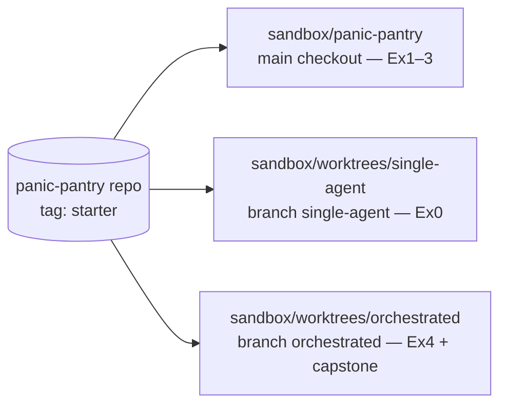

# Orchestration Fundamentals for Agentic Development — Student Guide

**Tool:** OpenCode **1.18.33** (your instructor pinned this version; every command and config example in these materials was verified 2026-09-28 on OpenCode 1.18.33).
**Sandbox:** the Panic Pantry snack shop in [../sandbox/panic-pantry](../sandbox/panic-pantry/README.md). Pure Python 3 standard library. Everything runs offline.
**Promise:** you leave having decomposed, delegated, run, reviewed, and integrated a real feature with OpenCode — not having watched someone talk about agents.

---

## The story you are walking into

Panic Pantry is a tiny late-night snack shop preparing the **Midnight Crunch Drop**. Marketing will hand over a CSV of promo codes minutes before launch. The shop already has one hard rule, enforced in code and written on the wall:

> **Discounts above 20% require manager approval.** A promo of exactly 20% is fine and becomes active. A promo of 21% or more is stored as `pending_approval` and cannot be applied at checkout until a human manager approves it.

The nightmare scenario: someone imports `FREE-ALL,100`, the importer skips the approval rule, a customer pays nothing, and the shop ships a truckload of pretzels into bankruptcy. Your job all afternoon is to build the importer *without* letting any agent — fast, clever, or free — bypass that rule.

One incident, four hours, every orchestration skill you need at work.

### The shop's code in 60 seconds

You will hear these names from the first exercise on. Here is what they are before you meet them in the code:

| Name | What it is | Where it lives |
|---|---|---|
| **Promotion** | One promo code (`CRUNCH10`) with a discount percentage and a **status** | `src/panic_pantry/models.py` |
| **Status** | `active` (usable at checkout) or `pending_approval` (stored, but rejected at checkout until a manager approves it) | `models.py` |
| **`PromotionService`** | The only door into the promotion store. Its `create_promotion` method **decides the status** — this is where the 20% rule is enforced | `src/panic_pantry/promotions.py` |
| **The store / seed data** | The shop's existing promotions. Every reset copies `data/promotions.json.seed` → `data/promotions.json`. The seed already contains `WELCOME10` (10%, active), `STAFF-PICK` (15%, active), `MIDNIGHT-VIP` (20%, active), and `BIGSPENDER` (30%, pending) | `data/` |
| **`import_promotions(csv_path, service)`** | The function you are building. It reads a CSV and creates promotions *through* the service | `src/panic_pantry/importer.py` (doesn't exist yet) |
| **`ImportReport`** | What the importer returns: four lists — `created`, `pending_approval`, `skipped_duplicate`, `errors` — so a human can see what happened to every row | same file |

Two consequences worth knowing now:

- **"Duplicate" includes codes already in the store.** A CSV row for `WELCOME10` is a duplicate even if it appears only once in the file — the seed already has it. The course calls these **seeded collisions**.
- **Every CSV row gets exactly one disposition** — the bucket it lands in: created-active, created-pending_approval, skipped_duplicate, or error. Line numbers count the header as line 1, so the first data row is line 2.

---

## Schedule (240 minutes total, 183 hands-on)

| Time | Min | Type | Segment |
|---|---:|---|---|
| 0:00–0:07 | 7 | Lecture | Opening — more agents ≠ more progress |
| 0:07–0:32 | 25 | **Hands-on** | Exercise 0 — warm-up + single-agent baseline |
| 0:32–0:38 | 6 | Lecture | Micro-lecture 1 — turn a wish into a ticket |
| 0:38–1:08 | 30 | **Hands-on** | Exercise 1 — task surgery |
| 1:08–1:18 | 10 | Break | |
| 1:18–1:24 | 6 | Lecture | Micro-lecture 2 — a role is a boundary |
| 1:24–1:56 | 32 | **Hands-on** | Exercise 2 — build a small agent crew |
| 1:56–2:02 | 6 | Lecture | Micro-lecture 3 — model choice is a budget decision |
| 2:02–2:34 | 32 | **Hands-on** | Exercise 3 — model routing |
| 2:34–2:39 | 5 | Break | |
| 2:39–2:45 | 6 | Lecture | Micro-lecture 4 — parallelism is a dependency claim |
| 2:45–3:22 | 37 | **Hands-on** | Exercise 4 — orchestrated run + matched comparison |
| 3:22–3:28 | 6 | Lecture | Micro-lecture 5 — a green check is evidence, not a handoff |
| 3:28–3:55 | 27 | **Hands-on** | Capstone — midnight launch |
| 3:55–4:00 | 5 | Close | Exit ticket |

**Arithmetic check:** hands-on = 25 + 30 + 32 + 32 + 37 + 27 = **183 min**. Lecture = 7 + 6 + 6 + 6 + 6 + 6 = 37. Breaks = 10 + 5 = 15. Close = 5. Total = 183 + 37 + 15 + 5 = **240 min**. ✔

---

## One-time setup (instructor runs this before class; you verify)

From the pack root:

```bash
bash sandbox/setup.sh
```

This makes `sandbox/panic-pantry` a git repo, tags the starter commit `starter`, and creates two matched worktrees at the **same commit**:

- `sandbox/worktrees/single-agent` — Exercise 0 baseline
- `sandbox/worktrees/orchestrated` — Exercise 4 orchestrated run

> ⚠️ **Re-running `bash sandbox/setup.sh` DISCARDS all changes inside both worktrees.** Only re-run it when you deliberately want a fresh comparison.

> 📘 **Concept — tags, branches, and worktrees (the 90-second Git primer)**
>
> - A **commit** is a saved snapshot of the whole project. A **tag** is a permanent name for one commit — `starter` always means "the shop before anyone touched it."
> - A **branch** is a movable name for a line of work. It starts at a commit and moves forward as you commit on it.
> - A **worktree** is an *extra working directory* attached to the same repository, each with its own branch checked out. One repo, several folders, each folder its own independent copy of the files. Editing a file in `worktrees/single-agent` cannot change the same file in `worktrees/orchestrated` — they are different files on disk.
> - Files Git already knows about are **tracked**. New files you create (your agent configs, your workshop notes) are **untracked** until committed — and untracked files exist *only* in the folder where you created them. That's why Exercise 4 has you copy them across.
>
> Why you care: the whole afternoon ends in a comparison — one agent vs. an orchestrated crew. Worktrees guarantee both runs start from the identical commit and can't contaminate each other. Module 4 covers this as a safety technique in its own right.



*Figure 0 — Where each exercise runs. One repository, three working directories.*
Text alternative: one repository tagged starter feeds three folders — the main checkout used in Exercises 1–3, the single-agent worktree used in Exercise 0, and the orchestrated worktree used in Exercise 4 and the capstone.

Verify your environment (from `sandbox/panic-pantry`):

```bash
bash scripts/check_env.sh
```

Expected: python3 and git versions print, `opencode --version` prints `1.18.33`, and the test suite ends with `OK (skipped=9)` — 23 tests, 9 skipped. The 9 skips are the importer acceptance tests waiting for a file you have not written yet. They are the finish line, not a problem. (Mechanically: `tests/test_importer_contract.py` tries to import `panic_pantry.importer`; while that file is missing, the whole test class is marked `skipUnless` and skipped. The moment `importer.py` exists, all 9 switch on and become your acceptance gate.)

Reset the sandbox anytime with:

```bash
bash scripts/reset.sh
```

**File ownership manifest:** [workshop/WRITABLE_FILES.md](../sandbox/panic-pantry/workshop/WRITABLE_FILES.md) lists exactly what you (and your agents) may edit per exercise. Treat it as law.

**Project rules for agents:** [AGENTS.md](../sandbox/panic-pantry/AGENTS.md) at the repo root is read automatically by OpenCode as project rules — no prompt needed ([docs: rules](https://opencode.ai/docs/rules), verified 2026-09-28 on OpenCode 1.18.33). `/init` can generate one; ours already exists. (A **harness** is everything around the model that shapes what it does — rules files, tools, permissions, tests. The model is the engine; the harness is the steering, brakes, and guardrails.) OpenAI's harness-engineering write-up recommends keeping this file a ~100-line table of contents and enforcing the real rules mechanically with tests — which is exactly how this sandbox is built ([OpenAI: Harness Engineering](https://openai.com/index/harness-engineering/), Feb 2026).

---

## How to use these files

Work through the modules in order. Each module is a short lecture summary followed by the hands-on exercise it sets up — the course rhythm is always **claim → story/evidence → framework → exercise → debrief**.

| Module | File | Segments covered |
|---|---|---|
| 0 | [module-0-baseline.md](module-0-baseline.md) | Opening lecture + Exercise 0 — warm-up + single-agent baseline |
| 1 | [module-1-decomposition.md](module-1-decomposition.md) | Micro-lecture 1 + Exercise 1 — task surgery + the task-card template |
| 2 | [module-2-agent-crew.md](module-2-agent-crew.md) | Micro-lecture 2 + Exercise 2 — build a small agent crew |
| 3 | [module-3-model-routing.md](module-3-model-routing.md) | Micro-lecture 3 + Exercise 3 — model routing |
| 4 | [module-4-parallel-run.md](module-4-parallel-run.md) | Micro-lecture 4 + Exercise 4 — orchestrated run + matched comparison |
| 5 | [module-5-capstone.md](module-5-capstone.md) | Micro-lecture 5 + Capstone — midnight launch + the 5-minute close |
| — | [appendices.md](appendices.md) | Objective coverage map, command crib sheet + agent-file skeleton, sources, image credits |

Watch for three recurring callouts:

- 📘 **Concept** — a term or mechanism explained right where you first need it. If one says "quick version," the full treatment comes in a later module.
- 🔑 **Key takeaway** — the one sentence to remember from that point in the module.
- 💡 **Field note** — how the exercise maps to your daily engineering work.

---

## Key terms at a glance

Skim this now; come back whenever a word stops making sense. Each term links to where it's taught in depth.

**Orchestration vocabulary**

| Term | Plain-English meaning | Taught in |
|---|---|---|
| **Orchestration** | Splitting a feature into checkable tasks, handing them to agents, and integrating what comes back — you as the release lead | [Module 0](module-0-baseline.md) |
| **Contract** | The agreed interface and rules every task builds against: function signature, return shape, edge-case behavior, policy | [Module 1](module-1-decomposition.md) |
| **Freeze (a contract)** | Declare it final *before* work starts. Nobody changes it mid-run; if it must change, you stop, re-freeze, and re-brief everyone | [Module 1](module-1-decomposition.md) |
| **Task card** | Your written spec for one delegated task: outcome, scope, contract, checks, return format | [Module 1](module-1-decomposition.md) |
| **Task packet** | Everything you actually *send* in one delegation: the card, plus paths, the contract text, and the checks. The card is the recipe; the packet is the recipe handed to a cook | [Module 1](module-1-decomposition.md) |
| **Acceptance check** | An executable way to decide "done" — a command or a concrete review question. "Looks good" isn't one | [Module 1](module-1-decomposition.md) |
| **Critical path** | The chain of dependent tasks that sets the earliest possible finish. Delay anything on it and launch slips | [Module 1](module-1-decomposition.md) |
| **Idempotent** | Safe to run twice: the second run changes nothing | [Module 1](module-1-decomposition.md) |
| **Disposition** | The decided outcome for an item. For a CSV row: which `ImportReport` bucket it lands in. For a review finding: fix, accept with reason, or defer with an owner | [Module 3](module-3-model-routing.md), [Module 5](module-5-capstone.md) |
| **Intervention** | Any time you step into a run to steer it — a correction, clarification, or manual edit | [Module 0](module-0-baseline.md) |
| **Matched comparison** | Two runs with the same commit, ticket, tests, model, and timebox, so the only difference is the approach | [Module 4](module-4-parallel-run.md) |

**OpenCode vocabulary**

| Term | Plain-English meaning | Taught in |
|---|---|---|
| **Primary agent** | The agent you talk to directly in the main conversation. Built-ins: **Build** (full tools) and **Plan** (edits and shell require your approval). Tab switches between them | [Module 0](module-0-baseline.md) |
| **Subagent** | A helper agent the primary (or you) hands one task to. Built-ins in 1.18.33: **explore** (fast, read-only codebase search) and **general** (multi-step research and tasks). You'll build your own | [Module 2](module-2-agent-crew.md) |
| **Session / child session** | A session is one conversation. A delegation creates a **child session** under it — a new conversation with fresh, empty context | [Module 2](module-2-agent-crew.md) |
| **Session tree** | A parent session plus the child sessions its delegations created. You walk it with the child-navigation keys | [Module 2](module-2-agent-crew.md) |
| **@-mention** | *You* choose the subagent: `@reviewer check the diff` | [Module 2](module-2-agent-crew.md) |
| **Task tool** | The tool the *primary agent* calls to delegate on its own. It chooses the subagent by reading each subagent's `description` | [Module 2](module-2-agent-crew.md) |
| **Permission** (`allow` / `ask` / `deny`) | Configured authority per action: `allow` runs, `ask` pauses for your approval, `deny` blocks — whatever the prompt says | [Module 2](module-2-agent-crew.md) |
| **Frontmatter** | The YAML block between `---` fences at the top of an agent file — its settings. The body below is its system prompt | [Module 2](module-2-agent-crew.md) |
| **Provider / model ID** | A provider is a model service (Anthropic, OpenAI, OpenCode Zen, …). Models are named `provider_id/model_id` | [Module 3](module-3-model-routing.md) |
| **Variant (effort)** | A preset for the same model — e.g., a higher thinking budget or reasoning effort. `ctrl+t` cycles variants | [Module 3](module-3-model-routing.md) |
| **Leader key** | A prefix key for many shortcuts; `ctrl+x` by default. `<Leader>+Down` means press `ctrl+x`, release, then press ↓ | [Module 0](module-0-baseline.md) |
| **Foreground / background delegation** | Foreground: the primary waits for the child to finish. Background: the child runs while the primary keeps working (experimental in the V1 line; not used live today) | [Module 4](module-4-parallel-run.md) |

**Git vocabulary** — tag, branch, worktree, tracked/untracked: see the primer in [One-time setup](#one-time-setup-instructor-runs-this-before-class-you-verify) above.

---

## Classroom version note

> **One-time version note:** OpenCode V2 exists and renames some vocabulary (`permissions`, `shell`, `subagent`). This class uses **V1 syntax only**, matching the pinned 1.18.33 binary. If a doc page or blog snippet looks different from these materials, check which major version it targets before trusting it.

Start here: [module-0-baseline.md](module-0-baseline.md)
