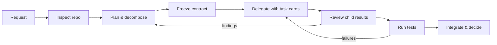

# Module 0 — Opening + Exercise 0: the vague ticket and the single-agent baseline

**Where you are:** you have a verified sandbox (`OK (skipped=9)` — 23 tests, 9 skipped) and the Panic Pantry story from the [course index](README.md). This module sets the incident, shows the loop you will run all afternoon, and produces the single-agent baseline that Exercise 4 will be measured against.

---

## Opening — More agents do not automatically mean more progress

The release is at midnight. The discount code is `FREE-ALL`. The shop is out of pretzels and, somehow, in debt.

**Claim: agents multiply the quality of your plan — including a bad one.** One agent given a vague request makes vague guesses. Five agents given a vague request make five *different* vague guesses, concurrently, in your codebase. Anthropic's multi-agent research system showed real wins on parallelizable research tasks, but at roughly 15× the tokens of a chat session, and they note that coding has fewer truly parallelizable tasks than research does ([Anthropic: How We Built Our Multi-Agent Research System](https://www.anthropic.com/engineering/multi-agent-research-system), Jun 2025 — their system, not a universal constant).

Your role today is **release lead**: the person who turns "add an importer" into commissioned, checkable work — and who owns the integrated result. Think of a restaurant pass: many stations, one ticket, one person who decides what actually goes out the door.



*Figure 1 — The orchestration loop you will run all afternoon.*
Text alternative: a cycle — request, inspect the repo, plan and decompose, freeze the contract, delegate with task cards, review child results, run tests, integrate and decide; review findings loop back to planning, test failures loop back to delegation.

> 🔑 **Key takeaway:** The next 25 minutes measure your plan, not the model — a baseline is only useful if you keep the conditions honest.

---

## Exercise 0 — The vague ticket (25 min) 🔨

**Goal:** feel the gap between "ask for a feature" and "commission a task," then produce a single-agent baseline you will compare against in Exercise 4.

**Starting checkpoint:**

```bash
cd sandbox/worktrees/single-agent
git status                                   # clean, branch single-agent
python3 -m unittest discover -s tests -v     # ends OK (skipped=9)
opencode                                     # start OpenCode in this directory
```

### Part A — Ask for a plan, not a patch (~6 min)

In OpenCode, press **Tab** to switch to the **Plan** primary agent (Tab toggles Build/Plan; in Plan, edits require approval (ask) — verified 2026-09-28 on OpenCode 1.18.33, [docs: agents](https://opencode.ai/docs/agents)). Paste exactly:

```text
Add a CSV importer for promo codes. Show me your plan first. Do not edit any files.
```

Read the plan skeptically. In your notes, record:

- Every **assumption** the agent made (columns? duplicates? errors? file location?)
- Every **policy** it did or did not mention
- Every **interface** it guessed at
- What "done" would even mean under this plan

### Part B — Find the real rules (~4 min)

Inspect the repo yourself — the authoritative sources, not the agent's summary:

```bash
cat AGENTS.md
cat tickets/TICKET-001.md
sed -n '1,30p' src/panic_pantry/promotions.py
```

Find the policy: **above 20% requires approval; exactly 20% is active.** Note where it is *enforced* (not just documented).

> 🔑 **Key takeaway:** The house rules live in the repo's enforcement code, not in the agent's summary — read the source that raises the error, not the prose that describes it.

### Part C — The baseline run (15-minute timebox — the instructor calls start/stop)

Switch back to the **Build** agent (Tab). One primary agent, **no subagents**. Paste exactly:

```text
Implement tickets/TICKET-001.md exactly as written. Create src/panic_pantry/importer.py
and nothing else outside the ticket's scope. When done, run:
python3 -m unittest discover -s tests -v
and show me the output.
```

Intervene when you need to (count each intervention). At the 15-minute mark, stop regardless of state. Fill in the scorecard during the transition into Micro-lecture 1 — the timebox is for the run, not the paperwork:

| Metric | Your value |
|---|---|
| Elapsed time (of 15 min) | |
| Contract tests passing (`python3 -m unittest tests.test_importer_contract -v`) | |
| Whole suite (`python3 -m unittest discover -s tests -v`) | |
| Policy handled correctly? (>20% → pending, exactly 20 → active) | |
| Human interventions (count) | |
| Files changed (`git status`) | |
| Token/cost data (`opencode stats`, if visible) | |

Save the diff for the comparison: `git diff > /tmp/baseline.diff`

> 💡 **Field note:** This scorecard is how you should evaluate *any* AI-tooling claim at work: timeboxed run, matched conditions, counted interventions, saved artifacts. "It felt faster" is not a metric; a filled scorecard is.

**Required artifact:** the filled scorecard + saved diff. Keep notes outside the worktree (the worktree stays pristine except for ticket-scoped files — see [WRITABLE_FILES.md](../sandbox/panic-pantry/workshop/WRITABLE_FILES.md)).

**Acceptance checks:**
- [ ] You can name where the approval policy is enforced (file + function).
- [ ] You listed ≥3 assumptions the vague-prompt plan made.
- [ ] You have a scorecard and saved diff from a stopped-at-15-minutes run.

**Hints (use in order):**
1. The agent's plan mentioned nothing about approval? Neither did your prompt. Where would a new hire look for the house rules?
2. `AGENTS.md` names the file that enforces promotion policy. Read that file's docstring.
3. The full contract — including the exact `ImportReport` fields and 1-based line numbers — is in `tickets/TICKET-001.md`. Part C should hand the agent that ticket, not your memory of it.

**Troubleshooting:**
- Tests won't run → you must be in the worktree root (`sandbox/worktrees/single-agent`), not `tests/`.
- OpenCode opens the wrong project → quit, `cd` into the worktree, relaunch.
- Worktree dirty before starting → ask the instructor before resetting; `bash sandbox/setup.sh` rebuilds worktrees but **discards all worktree work**.

**Debrief:** What did the vague plan silently decide for you? What would that cost in your real codebase? Which of your recorded interventions was really a missing piece of context you could have supplied up front?

> 🔑 **Key takeaway:** Every intervention you counted was a piece of context you could have shipped up front.

---

**Next:** [module-1-decomposition.md](module-1-decomposition.md) — turn the wish you just watched flounder into a ticket with a frozen contract.
