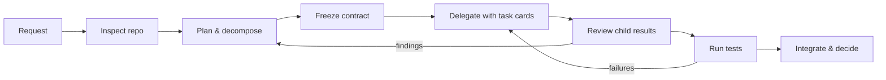
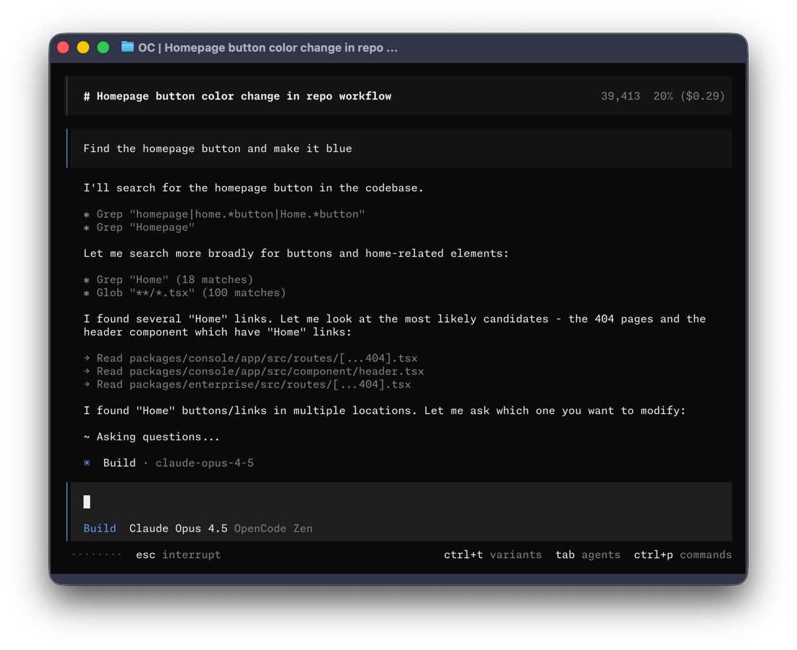

# Module 0 — Opening + Exercise 0: the single-agent baseline

**Where you are:** you have a verified sandbox (`OK (skipped=9)` — 23 tests, 9 skipped) and the Panic Pantry story from the [course index](README.md). This module sets the incident, shows the loop you will run all afternoon, and produces the single-agent baseline that Exercise 4 will be measured against.

---

## Opening — More agents do not automatically mean more progress

The release is at midnight. The discount code is `FREE-ALL`. The shop is out of pretzels and, somehow, in debt.

**Claim: agents multiply the quality of your plan — including a bad one.** One agent given a vague request makes vague guesses. Five agents given a vague request make five *different* vague guesses, concurrently, in your codebase. Anthropic's multi-agent research system showed real wins on parallelizable research tasks, but at roughly 15× the tokens of a chat session, and they note that coding has fewer truly parallelizable tasks than research does ([Anthropic: How We Built Our Multi-Agent Research System](https://www.anthropic.com/engineering/multi-agent-research-system), Jun 2025 — their system, not a universal constant).

Your role today is **release lead**: the person who turns "add an importer" into commissioned, checkable work — and who owns the integrated result. Think of a restaurant pass: many stations, one ticket, one person who decides what actually goes out the door.


*The pass (or "expo station"): the counter where every plate is checked against the ticket before it leaves the kitchen. The cooks at the stations are your agents; the person at the pass is you. Photo: MarkBuckawicki, [Wikimedia Commons](https://commons.wikimedia.org/wiki/File:Restaurant_Kitchen_expo_station.jpg), CC0.*



*Figure 1 — The orchestration loop you will run all afternoon.*
Text alternative: a cycle — request, inspect the repo, plan and decompose, freeze the contract, delegate with task cards, review child results, run tests, integrate and decide; review findings loop back to planning, test failures loop back to delegation.

> 📘 **Concept — three words from Figure 1 (quick version)**
>
> - **Contract** — the agreed shape of the work: the function signature, what it returns, how every edge case behaves, which policy it must respect. **Freezing** it means declaring it final *before* anyone builds against it. (Full treatment: [Module 1](module-1-decomposition.md).)
> - **Delegate** — hand one task to a helper agent (a **subagent**) that works in its own separate conversation. (Full treatment: [Module 2](module-2-agent-crew.md).)
> - **Child results** — what a subagent hands back when it finishes: its summary, the files it changed, the checks it ran. A claim to verify, not a fact. (Full treatment: [Module 5](module-5-capstone.md).)

> 🔑 **Key takeaway:** Agents multiply whatever plan you give them — so before you add agents, measure what one agent does with a good plan.

---

## Exercise 0 — The single-agent baseline (25 min) 🔨

**Goal:** give one agent the full ticket, measure what it does in 15 minutes, and save the result. In Exercise 4 you'll run the *same* ticket with a crew of agents — this baseline is what they have to beat. A short warm-up first shows you where an agent's rules come from.

| Step | Time | You do | Why |
|---|---|---|---|
| 1 — Warm-up | ~8 min | Vague prompt in Plan mode; trace where its plan came from | See what a prompt alone gives an agent — and what the repo gives it |
| 2 — Baseline run | 15 min, hard stop | Full ticket in Build mode; fill the scorecard | Create the measured result Exercise 4 is compared against |

**Starting checkpoint:**

```bash
cd sandbox/worktrees/single-agent
git status                                   # clean, branch single-agent
python3 -m unittest discover -s tests -v     # ends OK (skipped=9)
opencode                                     # start OpenCode in this directory
```

*Why a separate worktree:* the baseline gets its own clean copy of the repo, so nothing you do later in the main checkout can leak into it.

### Your cockpit — a 60-second tour of the OpenCode TUI



*The OpenCode TUI. Your models and version will differ; the layout won't. Screenshot: [OpenCode project](https://github.com/sst/opencode), MIT License.*

Read the bottom of the screen like a dashboard — it answers "who am I talking to, running on what?":

| On screen | What it tells you | Key |
|---|---|---|
| **Build** / **Plan** (left of the input box) | Which **primary agent** you're talking to | **Tab** switches |
| Model name (e.g., *Claude Opus 4.5*) | The model this agent is using right now | `/models` to change |
| Provider (e.g., *OpenCode Zen*) | The service the model comes from | `/connect` adds one |
| `ctrl+t variants` | Cycles **variants** of the model — e.g., more or less reasoning effort | **ctrl+t** |
| `ctrl+p commands` | Command palette — every action, searchable | **ctrl+p** |
| `esc interrupt` | Stop the agent mid-run | **esc** |

> 📘 **Concept — Build vs. Plan, and the leader key (quick version)**
>
> A **primary agent** is the one you talk to directly. OpenCode ships two: **Build** (the default — reads, edits files, runs commands) and **Plan** (for analysis — it must ask your approval before every edit or command). Later you'll meet **subagents**, helpers a primary hands a single task to ([Module 2](module-2-agent-crew.md)); today uses none.
>
> Many shortcuts start with the **leader key**, `ctrl+x`. `<Leader>+n` means press `ctrl+x`, release, then `n`. You'll use two all day: **`<Leader>+n`** (or `/new`) for a fresh session and **`<Leader>+m`** (or `/models`) for the model picker.

> 🔑 **Key takeaway:** Before every run, read the status bar — which agent, which model, which variant. If you can't name all three, you can't compare the result.

### Step 1 — Warm-up: a vague prompt (~8 min)

**Why:** your real requests at work often look like this one-liner. You're finding out what the agent does with it — and whether its rules came from *you* or from the repo.

1. Press **Tab** to switch to **Plan**, then paste exactly:

   ```text
   Add a CSV importer for promo codes. Show me your plan first. Do not edit any files.
   ```

2. **Don't answer its questions.** If it asks anything (e.g., "Should I add my own tests?"), press **Esc** and reply: `Don't resolve these — list them as open questions in the plan.` *Why:* every answer you give is context the agent didn't find itself, and that's what you're measuring.

3. In your notes, record three things:
   - **Source** — where did its rules come from: your prompt, `AGENTS.md`, or `tickets/TICKET-001.md`? Did it find the ticket without being told?
   - **Decisions** — ≥3 things it decided that no file told it to (open questions it raised count).
   - **One claim, checked** — pick something it says it "verified" and confirm it in the code. While you're there, find where the approval rule is **enforced**: `cat AGENTS.md`, then `sed -n '1,30p' src/panic_pantry/promotions.py`. *Why:* an agent's summary is a claim; the code that raises the error is the fact.

The rule you should find: **above 20% requires approval; exactly 20% is active.**

*If the plan looks good, that's the lesson, not a failed exercise: the repo supplied the context your prompt didn't. Most real repos don't have a TICKET-001 waiting. (Your instructor may show a recorded plan from a session that didn't find it.)*

> 🔑 **Key takeaway:** A vague prompt only works when the repo carries the context — here the ticket and `AGENTS.md` did the deciding, not your prompt. In [Module 1](module-1-decomposition.md) you'll learn to write that context yourself.

### Step 2 — The baseline run (15 min, hard stop — the instructor calls start/stop)

**Why:** this is the number Exercise 4 is measured against. A comparison is only honest if both runs get identical conditions — so you'll record those conditions as carefully as the result.

**Before you paste:**
- [ ] `/new` — a fresh session, so nothing from Step 1 leaks in.
- [ ] **Tab** back to **Build**.
- [ ] Write down the exact **model and variant** from the status bar. Exercise 4 must use the same one.
- [ ] One agent only: don't @-mention anyone or ask it to delegate. (If it delegates on its own, let it and note it — that's data too.)

Then paste exactly:

```text
Implement tickets/TICKET-001.md exactly as written. Create src/panic_pantry/importer.py
and nothing else outside the ticket's scope. When done, run:
python3 -m unittest discover -s tests -v
and show me the output.
```

**During the run:**
- Step in when you need to, and **count every intervention** — a correction, an answer to its question, a "keep going" nudge, a hand edit. Don't count the starting prompt or a plain permission approval. *Why:* see the note below; Exercise 4 counts them the same way.
- If it asks whether to write its own tests, answer `No — contract test only.` (That counts as an intervention.) *Why:* `tests/test_promo_import.py` is reserved for Exercise 4's Breaker, and extra scope here would unbalance the comparison.
- At 15:00, stop — finished or not. "Unfinished" is valid data.

> 📘 **Concept — why interventions are the hidden cost of a run**
>
> Tests passed, time taken and tokens used all leave out one thing: how much of *your* attention the run needed. A run that passes 9 of 9 tests in 12 minutes looks identical on paper whether you left it alone or stepped in six times to correct it — but each of those six meant someone watching, reading, diagnosing and typing. The intervention count is the only scorecard row that captures that human effort.
>
> It matters more as you add agents. One agent that needs babysitting is annoying; five that each need it are impossible, because you can't watch five screens. So the count is your best measure of *"could this run without me?"* — exactly what Exercise 4 tests.

**After the stop**, fill in the scorecard (you can finish it during the transition into Micro-lecture 1) and save the diff:

| Metric | Your value |
|---|---|
| Model + variant (exactly as the status bar shows) | |
| Elapsed time (of 15 min) | |
| Contract tests passing (`python3 -m unittest tests.test_importer_contract -v`) | |
| Whole suite (`python3 -m unittest discover -s tests -v`) | |
| Policy handled correctly? (>20% → pending, exactly 20 → active) | |
| Human interventions (count) | |
| Files changed (`git status`) | |
| Token/cost data (`opencode stats`, if visible) | |

**How to fill in each row.** First make sure you're in the baseline worktree — every command below grades whatever folder you're in, so running them in the main checkout or the `orchestrated` worktree scores the wrong code:

```bash
cd sandbox/worktrees/single-agent     # from the course repo root, if you've moved
git branch --show-current             # must print: single-agent
```

| Row | How to measure it |
|---|---|
| **Contract tests passing** | Run `python3 -m unittest tests.test_importer_contract -v`. Record passing out of 9 (e.g., `Ran 9 tests … FAILED (failures=2)` → **7/9**). ⚠️ `OK (skipped=9)` means **0/9**: the contract tests skip themselves when `import_promotions` can't be imported — a missing file or misnamed function looks green. |
| **Whole suite** | Run `python3 -m unittest discover -s tests -v`. Record the last line, e.g., `23 run, OK` or `23 run, FAILED (failures=1, errors=1)`. Failures outside the 9 contract tests mean the agent broke something it shouldn't have touched. |
| **Policy handled correctly?** | Two checks. **(1) Behavior:** in the contract output, both `test_boundary_exactly_20_is_created_active` and `test_above_20_is_pending_and_unusable_at_checkout` say `ok`. **(2) Source:** in `git diff`, the importer reads `promo.status` from what `create_promotion` returns — it does *not* compare against 20 itself or import `APPROVAL_THRESHOLD_PCT`. Record **Yes** (both), **Yes, but reimplemented** (tests pass, importer checks 20 itself — violates ticket criterion 7), or **No** (a test fails). |
| **Files changed** | `git status --short`. Ideally one line: `?? src/panic_pantry/importer.py`. List anything else. |

Then save the diff. `importer.py` is a new, untracked file, so plain `git diff` would miss it — stage everything first:

```bash
git add -A && git diff --cached > /tmp/baseline.diff    # keep notes and the diff outside the worktree
```

> 💡 **Field note:** This scorecard is how you should evaluate *any* AI-tooling claim at work: timeboxed run, matched conditions, counted interventions, saved artifacts. "It felt faster" is not a metric; a filled scorecard is.

### Done when

- [ ] You have a filled scorecard and `/tmp/baseline.diff` from a run stopped at 15 minutes.
- [ ] Your Step 1 notes say where the plan's rules came from, list ≥3 decisions it made on its own, and record one claim you checked.
- [ ] You can name where the approval policy is enforced (file + function).

**Hints:**
1. Can't find the approval rule? `AGENTS.md` names the file that enforces it — read that file's docstring.
2. Baseline agent guessing at fields or line numbers? It needs the ticket, not your memory of it — the Step 2 prompt points at `tickets/TICKET-001.md` for exactly that reason.

**Troubleshooting:**
- Tests won't run → you must be in the worktree root (`sandbox/worktrees/single-agent`), not `tests/`.
- OpenCode opens the wrong project → quit, `cd` into the worktree, relaunch.
- Worktree dirty before starting → ask the instructor before resetting; `bash sandbox/setup.sh` rebuilds worktrees but **discards all worktree work**.

**Debrief:** Which of your interventions was really a missing piece of context you could have supplied up front? In your real codebase, where do the house rules live — and would an agent find them?

> 🔑 **Key takeaway:** Every intervention you counted was a piece of context you could have shipped up front.

---

**Next:** [module-1-decomposition.md](module-1-decomposition.md) — learn to write the kind of ticket your agent found for you, with a frozen contract.
