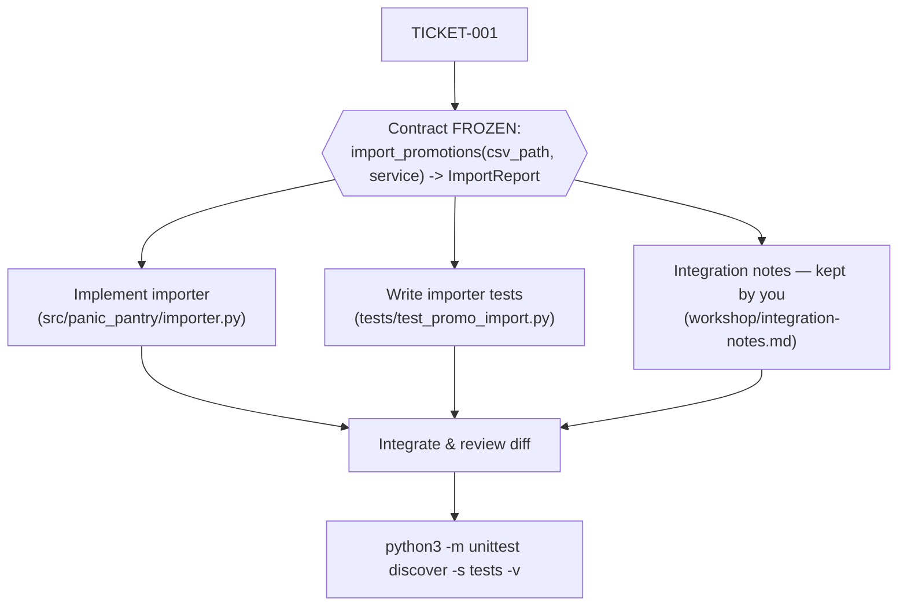
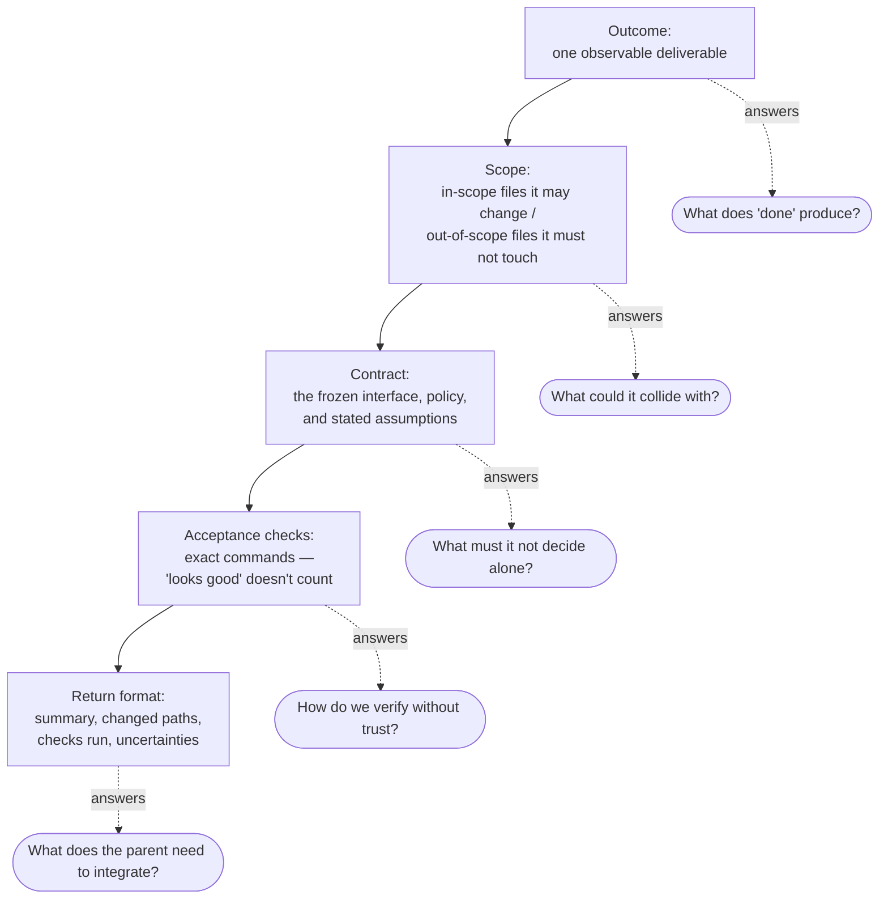

# Module 1 — Micro-lecture 1 + Exercise 1: task surgery

**Where you are:** you have a baseline scorecard and a saved diff from a single agent given the full ticket. You also have Part A's notes: where the vague prompt's plan got its rules, and what it decided on its own. This module turns that experience into a repeatable decomposition method — the plan and task cards you write here drive everything in Exercises 2 and 4.

---

## Micro-lecture 1 — Turn a wish into a ticket

**Claim: a delegated task needs a deliverable and a way to tell whether it is done.** Everything else — model choice, parallelism, agent roles — multiplies on top of that.

"Add a CSV importer" is a wish. `tickets/TICKET-001.md` is a ticket: exact function signature, exact report fields, exact edge cases (blank rows are errors; a missing header reports `(1, reason)` and imports nothing; re-runs are idempotent), and an executable acceptance gate. The difference is who does the deciding — you, or an agent guessing at midnight.

> 📘 **Concept — contract, freeze, idempotent**
>
> - A **contract** is the agreement every task builds against. For the importer it's the function signature `import_promotions(csv_path, service) -> ImportReport`, the four fields of `ImportReport`, the behavior of every edge case, and the policy the code must respect. In TICKET-001 it's the numbered "Acceptance criteria (the frozen contract)" list.
> - To **freeze** a contract is to declare it final *before* work starts. Once frozen, no agent changes it on its own initiative. If you discover it's wrong mid-run, you stop, fix it, re-freeze, and re-brief every task that depends on it. Freezing is what lets two agents work at once: each can trust the other side of the interface won't move.
> - **Idempotent** means *safe to run twice*: running the importer a second time on the same file creates nothing new. Every row that was created the first time comes back as `skipped_duplicate`. It matters because at midnight someone *will* click import twice.
>
> **Contract tests** are the tests that check the contract — here, `tests/test_importer_contract.py`. They're frozen too: if an agent "fixes" a failing contract test by editing it, it has moved the finish line.

Recall Exercise 0 Part A. If your agent's plan was good, it's because it found TICKET-001 — someone had already turned the wish into a ticket. Today that someone is you: most real repos have no ticket waiting, and the agent falls back to guessing. See the difference side by side:

> **Bad:** "Build the importer."
> The agent now decides the columns, the duplicate policy, the error behavior, the file it writes, and whether the approval rule even exists. Every one of those is a silent decision you'll discover at midnight.

> **Good (task card excerpt):**
> `Outcome: src/panic_pantry/importer.py satisfying every acceptance criterion in tickets/TICKET-001.md.`
> `In scope: src/panic_pantry/importer.py only.`
> `Acceptance checks: python3 -m unittest tests.test_importer_contract -v`
> Three lines in, the agent already knows what "done" produces, what it may touch, and how it will be judged.

The compact framework, for every task: **keep / delegate / sequence / defer.**

| Verdict | When | Importer example |
|---|---|---|
| **Keep** | tiny edits, coupled decisions, high ambiguity — coordination cost exceeds benefit | freezing the contract; owning the final integration |
| **Delegate** | distinct output, standalone context, checkable result | the importer implementation; the contract tests |
| **Sequence** | the task reads an output that doesn't exist yet | nothing implementation-shaped starts until the interface is frozen |
| **Defer** | value unclear, or blocked on information you don't have | a CLI wrapper nobody asked for — after midnight, if ever |

The phrase to carry home: **delegate by output and boundary, not by job title.** "You are a senior test engineer" produces a costume. "Deliver `tests/test_promo_import.py` asserting these six behaviors; touch nothing else; run this command" produces work.

> 🔑 **Key takeaway:** A delegated task needs a deliverable and a way to tell whether it is done — everything else multiplies on top of that.

Dependencies matter as much as outputs: the parser and the tests only become parallel *after* the interface between them is frozen. Before that, they are one conversation.



*Figure 2 — The importer feature as a dependency graph. Nothing below the gate starts until the contract freezes.*
Text alternative: TICKET-001 flows into a frozen-contract gate; only after the gate do three parallel tracks begin — importer implementation, new importer tests, and integration notes (kept by you) — and all three merge into integration, diff review, and the full test command.

> 📘 **Concept — two test files, two jobs**
>
> | File | Who writes it | Job | Can it change? |
> |---|---|---|---|
> | `tests/test_importer_contract.py` | Already in the repo | The **acceptance gate** — the referee that decides "done" | **Never.** Frozen. |
> | `tests/test_promo_import.py` | A test-author agent (Exercise 4) | A **second, independent expression** of the same contract, written from the ticket without reading the importer | Yes — it's a deliverable |
>
> Why write more tests when a gate already exists? Because the gate was written by one author, from one reading of the ticket. A second author working only from the contract catches what the first reading missed — and if the two disagree, you've found an ambiguity in the contract before midnight instead of after. Figure 2's third track, the integration notes, has no card because it stays with you: it's your running log of what arrived, what you checked, and what's still open.

### Which task sets the launch time? The critical path


*The critical path (red) is the longest chain of dependent tasks — it sets the earliest possible finish. A→B→E→C takes 3+1+3 = 7; every other route is shorter, so a delay anywhere off the red path costs nothing until it becomes longer than 7. Diagram: Illes, [Wikimedia Commons](https://commons.wikimedia.org/wiki/File:5n_PERT_graph_with_critical_path.svg), public domain.*

> 📘 **Concept — critical path**
>
> Draw your tasks as a dependency graph (like Figure 2). The **critical path** is the chain of tasks where each one waits for the one before, and whose total length decides the earliest you can finish. Speeding up a task *on* the path brings launch forward; speeding up a task *off* it changes nothing. For the importer, the question to ask is: *which single task, if it slips, delays everything below it?* (Hint: it's the one both other tracks read but never write.)

> 🔑 **Key takeaway:** Spend your attention on the critical path — a faster agent on a side branch doesn't move midnight.

Every card you write in this exercise answers five questions. If a part is missing, a specific failure gets in:



*Figure 3 — Anatomy of a task card: the five core parts; the full template adds inputs, dependencies, why-separate, and permissions/model.*
Text alternative: a vertical chain of the five task-card parts — outcome, scope, contract, acceptance checks, return format — each linked to the question it answers: what "done" produces, what it could collide with, what it must not decide alone, how to verify without trust, and what the parent needs to integrate.

> 📘 **Concept — card, packet, delegation message**
>
> Three terms you'll hear all afternoon, from most reusable to most specific:
>
> | Term | What it is | Analogy |
> |---|---|---|
> | **Task card** | The written spec for one task, saved as a file (`workshop/cards/*.md`) | The recipe |
> | **Task packet** | Everything the helper agent needs to work alone: the card *plus* the contract text, source paths, and checks, pasted in full | The recipe, ingredients, and plating photo handed to the cook |
> | **Delegation message** | The actual message you send (`@reviewer …`) that carries the packet | Handing it across the pass |
>
> The distinction matters because the helper can't open your card file by magic or remember your earlier chat. Only what's *in the message* reaches it — so the packet must stand on its own.

---

## Exercise 1 — Task surgery (30 min) 🔨

**Goal:** produce an executable plan and two complete handoff cards **before** any parallel implementation.

**Starting checkpoint:**

```bash
cd sandbox/panic-pantry            # the main checkout, at tag starter — NOT a worktree
git status                         # clean
mkdir -p workshop/cards
opencode
```

You may create/edit only `workshop/plan.md` and `workshop/cards/*.md` this exercise (per [WRITABLE_FILES.md](../sandbox/panic-pantry/workshop/WRITABLE_FILES.md)).

### Steps

1. **Delegate the investigation, keep the judgment.** Ask the built-in read-only **Explore** subagent to map the ground truth. @-mention it ([docs: agents](https://opencode.ai/docs/agents), verified 2026-09-28 on OpenCode 1.18.33):

```text
@explore Investigate this repo for TICKET-001 (tickets/TICKET-001.md). Return:
(1) the file and function that enforce the promotion approval policy, with the
exact threshold behavior; (2) the promotion code format and discount range rules;
(3) which files the ticket allows us to create or change; (4) the exact test
command; (5) anything in AGENTS.md that constrains an importer. Cite file paths
for every claim. Do not propose an implementation.
```

> 📘 **Concept — your first subagent (quick version)**
>
> A **subagent** is a helper that gets one task and works on it in its own **child session**: a separate conversation that starts empty. It sees only what you send plus the repo's `AGENTS.md`. Typing `@explore …` is an **@-mention**: *you* pick the helper and send it a message directly. **explore** is built in, fast, and read-only — ideal for "go find out" work. (OpenCode's other built-in subagent is **general**, for multi-step tasks.) When it finishes, its report appears back in your conversation. Module 2 explains child sessions and how to step inside them.

2. **Verify before you trust.** Spot-check at least two of its citations against the actual files. An investigation you didn't verify is a rumor with a table of contents.

3. **Write `workshop/plan.md`** containing:
   - the agreed import contract and edge cases (source: TICKET-001 — copy the frozen contract, don't paraphrase it);
   - tasks with owner, deliverable, and acceptance check for each;
   - dependency arrows and the critical path (which single task, if late, delays launch?);
   - which task stays with the primary agent, and **why**;
   - which tasks can run in parallel **after** the interface is frozen;
   - what context each child needs — and what it does *not* need.

   **Who can be an "owner"?** You don't have a crew yet, so write owners by role. You'll build the agents in Exercise 2 and assign them in Exercise 4:

   | Owner | Who it will be | Typical work |
   |---|---|---|
   | **You + the primary agent** | You, working through Build or Plan in the main conversation | Freezing the contract, integration, final decision |
   | **Implementer** | `@implementer`, which you create in Exercise 2 | Writing `importer.py` from a card |
   | **Test author** | A subagent the primary picks itself in Exercise 4 | Writing `tests/test_promo_import.py` from the contract |
   | **Reviewer** | `@reviewer`, which you create in Exercise 2 | Read-only review against a checklist |

4. **Fill the task card template twice**: `workshop/cards/csv_parser.md` (the parsing/validation logic inside `src/panic_pantry/importer.py`) and `workshop/cards/import_tests.md` (`tests/test_promo_import.py` written against the frozen contract). Use this template **verbatim**:

```markdown
## Task ID and title
Outcome: one observable deliverable
Why this task is separate: value of delegation / reason to keep it local
Inputs and source paths: facts the agent should inspect
Contract: agreed interfaces, rules, and assumptions
In scope: files or behavior it may change
Out of scope: files, behavior, and actions it must leave alone
Dependencies: task IDs that must finish first
Acceptance checks: exact tests, commands, or review questions
Permissions/model: authority required and selected model/effort
Return format: summary, changed paths, checks run, findings, uncertainties
```

   Two notes before you fill it in:

   - **`csv_parser` is a task name, not a file name.** That card covers *all* of `src/panic_pantry/importer.py`: parsing, validation, and the calls to `PromotionService`. There is no separate `csv_parser.py`.
   - **Write `Permissions/model: TBD` for now.** You'll learn permissions in Module 2 and model routing in Module 3, then come back and fill in this line before Exercise 4. An honest TBD beats a guess.

   **Remember seeded collisions when you copy the contract.** Criterion 5 treats a code as a duplicate if it's "already present in the store." The store isn't empty: it starts with the seed data (`WELCOME10`, `STAFF-PICK`, `MIDNIGHT-VIP`, `BIGSPENDER`). A card that only mentions "duplicates within the file" has dropped half the rule.

> 💡 **Field note:** A good task card is a good PR description written *before* the work: outcome, scope, checks, and what reviewers should look at. Teams that adopt the card format usually discover their human tickets improve too.

**Required artifact:** `workshop/plan.md` + two completed cards.

**Acceptance checks:**
- [ ] Plan states the policy as: discounts **above 20%** require approval; exactly 20% is active.
- [ ] Every task has an owner, a deliverable, and an *executable* acceptance check (a command or concrete review question — "looks good" doesn't count).
- [ ] The two cards' "In scope" file lists do not overlap.
- [ ] Each card's "Out of scope" names at least the frozen files: `tests/test_importer_contract.py`, `fixtures/`, `data/promotions.json.seed`, `scripts/`. (Why these? Each is part of how "done" gets measured: the gate, its test inputs, the starting store, and the reset/check tooling. An agent that edits any of them can make a broken importer look finished.)
- [ ] The plan names the critical path and explains why one task stays with the primary agent.

**Hints (use in order):**
1. Stuck on decomposition? List the *deliverable files* first (the ticket and WRITABLE_FILES name them), then work backward to tasks.
2. Critical path: which artifact do both other tasks read but never write? That freeze is your gate.
3. For "context each child needs": the test author needs the contract and fixture expectations — does it need to read the importer's implementation at all?

**Troubleshooting:**
- Explore tries to edit or wanders → it is read-only by design; restate the task packet with the numbered return format.
- Explore's answer is vague → your prompt probably was too. Ask for file-path citations per claim.
- Not sure what's writable → [WRITABLE_FILES.md](../sandbox/panic-pantry/workshop/WRITABLE_FILES.md), row "1 — Task surgery."

**Debrief:** Which decisions did writing the card force you to make that the vague prompt in Exercise 0 let you skip? On your team's codebase, who freezes an interface — and where would you write it down?

> 🔑 **Key takeaway:** The card forces the decisions the vague prompt let you skip — better to make them at 2 PM than discover them at midnight.

---

**Next:** [module-2-agent-crew.md](module-2-agent-crew.md) — give your cards to agents whose boundaries are configuration, not politeness.
