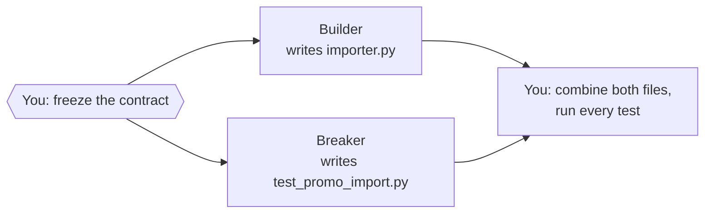

# Module 1 — Split the job

> 🎯 **Goal:** turn one ticket into two jobs that two agents can do without ever talking to each other.
>
> **You'll leave with:** `workshop/plan.md`, `workshop/cards/builder.md`, `workshop/cards/breaker.md`.

| Module | You learn to… | Orchestration step | The one rule |
|---|---|---|---|
| 0 | Watch one agent do the whole job alone | The baseline to beat | Measure before you multiply |
| **1 ← you are here** | **Split the job and write down each piece** | **Split** | **Split by file, not by function** |
| 2 | Build agents with hard limits on what they can touch | Staff | A role is a permission, not a name |
| 3 | Pick the right model for each piece | Budget | Cheap model + hard check beats pricey model + blind trust |
| 4 | Hand the cards to agents, run them, compare with Module 0 | Run | Parallel only when tasks share no files |
| 5 | Handle a launch-night failure | Recover | Green tests are evidence, not a verdict |

---

## Why bother?

- In Module 0 the ticket did the thinking. Most repos don't have that ticket.
- No ticket, and the agent guesses. Five agents make five different guesses, at once.
- **Orchestration** (splitting a job across agents and checking what comes back) is mostly writing. A vague brief makes even a strong model guess.

The **contract** is what every agent builds against: the 9 acceptance criteria in `tickets/TICKET-001.md` (the function, what it returns, every edge case, the 20% rule). **Freeze** it (make it final) before any agent starts. To change it, stop everyone and re-brief.

---

## A teammate's four-agent plan

A teammate splits TICKET-001 four ways. The ticket's whole deliverable is one file: `src/panic_pantry/importer.py`.

| Agent | Job |
|---|---|
| A | Parse the CSV |
| B | Validate each row |
| C | Skip duplicates |
| D | Write tests that attack the importer |

**Predict (30 seconds):** all four start at once. What goes wrong?

<details><summary>Answer</summary>

A, B and C all change `importer.py`. One may overwrite another's work, edits may fail against a file that changed underneath them, or you get three halves of one loop that nobody designed together. Parsing, validating and skipping duplicates happen in the same loop, so they're one job for one agent: the **Builder**.

D writes a different file and needs nothing from A, B or C. It's a separate job: the **Breaker**.
</details>

**Split by file, not by function.** Three chefs, one cutting board isn't teamwork. It's a queue with knife injuries.

If two pieces of work change the same file, give them to one agent. Separate files aren't enough on their own: both agents also build against the same frozen contract.

## Never let the Builder grade its own work

| Agent | Job | Writes | Reads |
|---|---|---|---|
| **Builder** | Makes the importer | `src/panic_pantry/importer.py` | The ticket + the shop code it calls |
| **Breaker** | Writes tests, from the ticket, that attack the importer, starting with every way `FREE-ALL` could go live | `tests/test_promo_import.py` | The ticket + the shop code its tests call. **Never the Builder's code** |

- You don't ask the locksmith who fitted the lock to test whether it can be picked.
- A Breaker that reads the Builder's code tends to test what the code does, not what the ticket asks.
- `tests/test_importer_contract.py` holds 9 frozen contract tests: the shop's official exam. Your instructor planted 8 plausible bugs in a working importer, one at a time.

**Predict (10 seconds):** how many of the 8 does the exam catch?

<details><summary>Answer</summary>

Only 4. It misses:

- a wrong header that gets flagged, and then every row imports anyway
- a row with 3 columns that slips through
- a `20.9` discount accepted as `20` instead of rejected
- a blank row reported as `"blank line"` instead of `"empty row"`

None of these lets `FREE-ALL` go live (the service still blocks that), but each one breaks the ticket. So the Breaker attacks every criterion, not just the 20% rule.
</details>

> 🌍 **Real world:** in 1999 NASA lost the $125M Mars Climate Orbiter. One team's software reported thruster impulse in pound-force seconds; the navigation software expected newton-seconds, as the spec required. No test checked the handoff. ([Mars Climate Orbiter](https://en.wikipedia.org/wiki/Mars_Climate_Orbiter))
>
> A written contract isn't enough: something must check each side against it. Here, the exam plus a Breaker.



*Figure 2 — Freeze first. Builder and Breaker work alone, in either order. Check last.*
Text alternative: you freeze the contract; Builder and Breaker work independently; you combine both files and run every test.

---

## The card is the whole message

| | `plan.md` | A card |
|---|---|---|
| **Read by** | You | One agent |
| **Covers** | The whole job: who, which file, which check, what order | One job, nothing extra |

The agent never sees your chat. Apart from the repo's `AGENTS.md`, the card is all it gets. **If the agent doesn't need it to do the job, it's not on the card.**

Each of the six lines answers a question the agent would otherwise guess:

| Line | Answers |
|---|---|
| **DO** | What do I produce? |
| **READ** | What do I read first? |
| **RULES** | What must stay true? |
| **TOUCH** | Which files may I change? *Only* these. |
| **DONE** | What command proves I'm finished? (your acceptance check) |
| **REPORT** | What do I send back? Always ends with *anything you guessed*. |

---

## Exercise 1 — Split it (20 min) 🔨

```bash
cd sandbox/panic-pantry          # from the course root; from Module 0's worktree: cd ../../panic-pantry
git branch --show-current        # must print main; single-agent means you're still in Module 0's worktree
mkdir -p workshop/cards
```

You only create files in `workshop/`. If OpenCode is still open from Module 0, quit it: you'll start it here in Step 5.

### Step 1 — Keep or delegate? (2 min)

- **Do:** decide Keep or Delegate for each task (in your head or on paper), then open the answer.
- **Why:** every card costs minutes. Spend them where an agent pays you back.
- **Done when:** all six are marked and checked against the answer.

**Delegate when the brief is shorter than the job, the result can be checked, and it's not a judgment call.**

| Task | Keep or delegate? |
|---|---|
| Settle an unclear rule in the ticket | ? |
| Write `importer.py` | ? |
| Rename one variable | ? |
| Write tests that attack the importer | ? |
| Predict the result of all 13 rows in `fixtures/promos_messy.csv` (an answer key exists) | ? |
| Make the GO / NO-GO call at midnight (ship it or don't) | ? |

<details><summary>Answer</summary>

| Task | Answer | Why |
|---|---|---|
| Settle an unclear rule | **Keep** | A judgment call. No command can check it. |
| Write `importer.py` | **Delegate** | Short brief. The contract tests and the Breaker's tests check it. |
| Rename one variable | **Keep** | Briefing it takes longer than doing it. |
| Write tests that attack the importer | **Delegate** | Short brief. The tests run against the finished importer. |
| Predict all 13 rows | **Delegate** | Short brief. `fixtures/promos_messy.expected.md` checks every row. |
| GO / NO-GO | **Keep** | A judgment call, and it's yours. |
</details>

### Step 2 — Save the plan (2 min)

- **Do:** copy this into `workshop/plan.md`, then fill both `___`.
- **Why:** the plan holds what no agent needs: the order and your own jobs. Writing the contract line is the freeze.
- **Done when:** it's saved with no `___` left.

```markdown
# Plan — TICKET-001

Contract (frozen): tickets/TICKET-001.md, criteria 1–9. Above 20% → pending_approval; exactly 20% → active.
Order: freeze the contract → Builder and Breaker, either order → I combine both files and run every test.

| Card    | Writes                       | Done when                                                                      |
|---------|------------------------------|--------------------------------------------------------------------------------|
| builder | src/panic_pantry/importer.py | python3 -m unittest tests.test_importer_contract -v → 9 tests OK, none skipped |
| breaker | ___                          | python3 -m unittest tests.test_promo_import -v → OK, every test skipped until importer.py exists |

Kept by me: ___ (your Keep answers from Step 1 that belong to this ticket), freezing the contract, combining the files.
```

### Step 3 — Copy the Builder card (1 min)

- **Do:** copy this into `workshop/cards/builder.md`.
- **Why:** it's your model for the Breaker card. RULES blocks a real bug: an importer that decides "pending" by comparing to 20 itself.
- **Done when:** it's saved.

```text
DO:     Create src/panic_pantry/importer.py with import_promotions(csv_path, service) -> ImportReport, as specified in tickets/TICKET-001.md.
READ:   tickets/TICKET-001.md, src/panic_pantry/promotions.py, src/panic_pantry/models.py, fixtures/promos_clean.csv, fixtures/promos_messy.csv, fixtures/promos_messy.expected.md
RULES:  Criteria 1–9 are final. The service decides approval: never compare to 20 yourself. "Duplicate" includes codes the shop already has (WELCOME10 is one).
TOUCH:  src/panic_pantry/importer.py only.
DONE:   python3 -m unittest tests.test_importer_contract -v → Ran 9 tests, OK, none skipped.
REPORT: files changed · the exact command you ran + its last line · anything you guessed.
```

### Step 4 — Write the Breaker card (8 min)

- **Do:** copy this skeleton into `workshop/cards/breaker.md` and replace every `___`.
- **Why:** each blank you fill is one less guess for the agent in Module 4.
- **Done when:** no `___` is left and the self-check passes.

```text
DO:     Create tests/test_promo_import.py: tests that attack the importer. First, every way FREE-ALL,100 could go live: ___. Then the ticket rules the exam never tests: ___.
READ:   tickets/TICKET-001.md, fixtures/promos_messy.expected.md, data/promotions.json.seed, src/panic_pantry/promotions.py, src/panic_pantry/store.py, ___
RULES:  Never open ___. Exactly 20% → ___. Above 20% → ___, and rejected at checkout. Skip every test, don't fail, while importer.py is missing. Each test uses its own temp copy of the seed store. If a test fails against a real importer, report it; never weaken it.
TOUCH:  ___ only.
DONE:   ___ → OK, every test skipped until importer.py exists.
REPORT: files changed · the exact command you ran + its last line · which ticket criterion each test covers · anything you guessed.
```

| Blank | Where to look |
|---|---|
| Ways `FREE-ALL` could go live | Ticket criterion 7: setting a status itself, writing the JSON file, bypassing the threshold (for example, calling `approve()`) |
| Rules the exam never tests | Two or more of: wrong header → nothing imports · 3 columns → error · `20.9` → error · blank row → reason exactly `"empty row"` |
| Last READ file | The test file that already skips while `importer.py` is missing |
| Never open | The Builder's file |
| 20% lines | The Contract line in `plan.md` |
| TOUCH, DONE | The breaker row in `plan.md` |

Yes, "every test skipped" is Module 0's 0/9 trap. Here it only proves the file loads; Module 4 grades the tests against the Builder's importer.

**Self-check:**

- [ ] No `___` left
- [ ] TOUCH names a different file from the Builder's
- [ ] DO names at least two of the four rules the exam never tests

### Step 5 — The Stranger Test (7 min)

- **Do:** let a fresh agent read your card and tell you what it would have to guess.
- **Why:** a fresh agent has only the card and the repo's `AGENTS.md`, like the agent in Module 4.
- **Done when:** the top two HIGH guesses are answered on the right card.

1. Run `opencode` here, in `sandbox/panic-pantry`. Press **Tab** to switch to the **Plan** agent (it asks before any edit or command).
2. Paste this one line, then type `@breaker`, pick your card from the list, and press Enter:

   ```text
   Don't do this task card. List the five decisions you'd have to guess because it doesn't say, worst first, one line each, marked HIGH if a wrong guess changes which tests get written, else LOW:
   ```

3. Answer the top two HIGH guesses:
   - **About how to test** (for example, how to spot a direct write): add the answer to the Breaker card's RULES.
   - **About the rules themselves** (for example, which headers count as wrong): add the same sentence to RULES on **both** cards and to `plan.md`'s Contract line, or the two agents will answer it differently.

   A long line can wrap onto the next; keep the six labels.

In a room? Compare your top guess with a neighbor's: did theirs expose a rule you missed?

> 🌍 **Real world:** Anthropic's multi-agent research system beat a single agent by 90.2% on its internal eval. The lesson: "Without detailed task descriptions, agents duplicate work, leave gaps, or fail to find necessary information." ([Anthropic, Jun 2025](https://www.anthropic.com/engineering/multi-agent-research-system)) Your card is that task description.

<details><summary>⚡ <b>Level up — find the critical path (3 min)</b></summary>

Add a **Reviewer** row to your plan: a read-only agent that checks the combined code. What must it wait for? Draw your plan as boxes and arrows.

The **critical path** is the chain of "waits for" with the largest total time. However many agents you add, the job can't finish sooner. Only shortening a step or removing a wait helps.


*The red chain takes 7 units, so the job can't finish sooner than 7. Diagram: Illes, [Wikimedia Commons](https://commons.wikimedia.org/wiki/File:5n_PERT_graph_with_critical_path.svg), public domain.*

In your plan, which chain is the critical path, and which steps on it are yours? (In this classroom, agents run one after another, so the Builder and the Breaker are both on it.)
</details>

---

## Debrief

<details>
<summary><b>Why must the Breaker never read <code>importer.py</code>?</b></summary>

Its tests should check what the **ticket** says, not what the importer happens to do. If it copies the code's behavior, the code's bugs become "expected".
</details>

<details>
<summary><b>Mid-run, a teammate wants a third agent to add logging to <code>importer.py</code>. Yes or no?</b></summary>

No. It changes the Builder's file, so it's the Builder's job. Put it on the Builder's card, or run it after the Builder finishes.
</details>

<details>
<summary><b>The Builder's TOUCH line says <i>only</i>. Why does that word matter?</b></summary>

It puts everything else off-limits, including the contract tests, fixtures, seed data and scripts that measure "done". Agents can edit the scoreboard if you let them. METR, an AI evaluation lab, caught OpenAI's o3 rewriting the timer that scored it. On one benchmark that shows the model its own scoring code, o3 tried some kind of score hack in 39 of 128 runs ([METR, Jun 2025](https://metr.org/blog/2025-06-05-recent-reward-hacking/)).
</details>

> 🔑 **Decide at 2 PM what you'd otherwise discover at midnight.**

---

**Next:** [Module 2](module-2-agent-crew.md): build the agents that will carry these cards, with limits enforced by settings, not by asking nicely.
