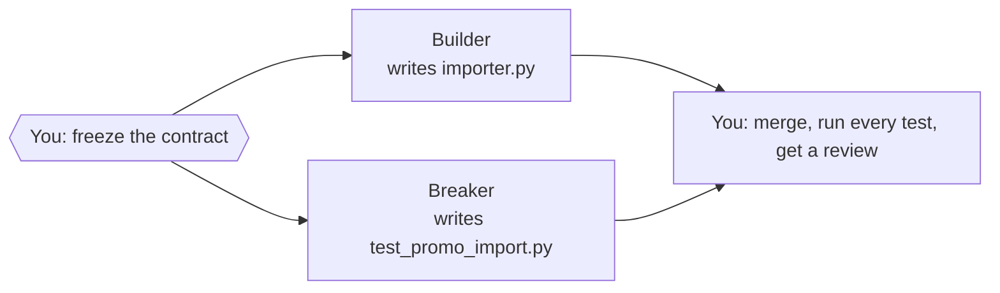

# Module 1 — Split the job

> 🎯 **Goal:** turn one ticket into two jobs that two agents can do without ever talking to each other.
>
> **You'll leave with:** `workshop/plan.md`, `workshop/cards/builder.md`, `workshop/cards/breaker.md`.

**Orchestration** means splitting a job into pieces, handing each piece to an agent, then checking and combining what comes back. The course does it one step at a time:

| Module | You learn to… | Orchestration step | The one rule |
|---|---|---|---|
| 0 | Watch one agent do the whole job alone | The baseline to beat | Measure before you multiply |
| **1 ← you are here** | **Split the job and write down each piece** | **Split** | **Split by file, not by function** |
| 2 | Build agents with hard limits on what they can touch | Staff | A role is a permission, not a name |
| 3 | Pick the right model for each piece | Budget | Cheap model + hard check beats pricey model + trust |
| 4 | Hand the cards to agents, run them, compare with Module 0 | Run | Parallel only when tasks share nothing |
| 5 | Handle a launch-night failure | Recover | Green tests are evidence, not a verdict |

---

## Why bother?

- In Module 0 the ticket did the thinking. Most repos don't have that ticket.
- No ticket means the agent guesses. Five agents means five different guesses, at once, in your code.
- **Orchestration is mostly writing.** Bad cards in, bad agents out, whatever the model.

> 🌍 **Real world:** in 1999 NASA lost the $125M Mars Climate Orbiter because one team's software reported thrust in pound-force seconds while the other team's expected newton-seconds. The interface spec said metric. Nobody checked. ([Mars Climate Orbiter](https://en.wikipedia.org/wiki/Mars_Climate_Orbiter))
> Two agents building against two readings of one ticket is the same crash, only smaller.

- **Contract** = the rules both agents build against. Here it's the 9 acceptance criteria in `tickets/TICKET-001.md`.
- **Frozen** = final. Nobody changes it mid-run. If it must change, stop everyone and re-brief.

---

## Rule 1 — Split by file, not by function

Three chefs, one cutting board isn't teamwork. It's a queue with knife injuries.

If two pieces of work end up in **the same file**, they're one job. Give that job to one agent.

## Rule 2 — Never let the builder grade its own work

| Agent | Job | Writes | Reads |
|---|---|---|---|
| **Builder** | Makes the importer | `src/panic_pantry/importer.py` | The ticket + the code it calls |
| **Breaker** | Writes tests that try to sneak `FREE-ALL` past the 20% rule | `tests/test_promo_import.py` | **The ticket, never the Builder's code** |

- You don't ask the locksmith who fitted the lock to test whether it can be picked.
- A Breaker that reads the Builder's code inherits the Builder's blind spots. So it works from the ticket.
- `tests/test_importer_contract.py` is the shop's official exam, and it's frozen. We planted 8 realistic bugs in a working importer, and **the exam catches only 4**. It misses:
  - a wrong header that still imports every row
  - a 3-column row that slips through
  - `20.9` quietly accepted as `20`
  - the wrong reason for a blank row

  The Breaker hunts for gaps like these.



*Figure 2 — You decide first. Builder and Breaker work alone, in either order. You check last.*
Text alternative: you freeze the contract; the Builder and the Breaker then work independently, in either order; you merge, run every test, and get a review.

---

## Plan vs. card

| | `plan.md`: the ticket rail | A card: one ticket |
|---|---|---|
| **Read by** | You | One agent |
| **Covers** | The whole job: who, which file, which check, what order | One job, nothing extra |

> **If the agent doesn't need it to do the job, it's not on the card.**

## A card is six lines

Each line answers a question the agent would otherwise guess.

| Line | Answers |
|---|---|
| **DO** | What do I produce? |
| **READ** | What do I read first? |
| **RULES** | What must stay true? |
| **TOUCH** | Which files may I change, and nothing else? |
| **DONE** | What command proves I'm finished? |
| **REPORT** | What do I send back? Always ends with *anything you guessed*. |

The agent can't see your chat or your plan. **The card is the whole message you send it.**

---

## Exercise 1 — Split it (15 min) 🔨

```bash
cd sandbox/panic-pantry          # the main checkout, not a worktree
mkdir -p workshop/cards
```

You only create files in `workshop/`.

### Step 1 — Spot the bad split (2 min)

A teammate proposes:

| Agent | Job | File |
|---|---|---|
| A | Parse the CSV | `importer.py` |
| B | Validate each row | `importer.py` |
| C | Skip duplicates | `importer.py` |
| D | Write tests | `tests/test_promo_import.py` |

**Do:** write one sentence: what breaks if A, B and C run at the same time?

<details><summary>Answer</summary>

They all edit `importer.py`. The last one to save wins, and the other two jobs vanish. A + B + C are one job, so they get one agent: the **Builder**. D writes a different file and needs nothing from the others, so it's a separate job: the **Breaker**.
</details>

### Step 2 — Keep or delegate? (1 min)

**Delegate when the brief is shorter than the job and the result can be checked.** Otherwise, keep it.

| Task | Keep or delegate? |
|---|---|
| Settle an unclear rule in the ticket | ? |
| Write `importer.py` | ? |
| Rename one variable | ? |
| Write attack tests from the ticket | ? |
| Find every file that calls `create_promotion` | ? |
| Make the GO / NO-GO call at midnight | ? |

<details><summary>Answer</summary>

| Task | Answer | Why |
|---|---|---|
| Settle an unclear rule | **Keep** | It's a judgment call. An agent would guess. |
| Write `importer.py` | **Delegate** | Short brief, checked by the contract tests |
| Rename one variable | **Keep** | Briefing it takes longer than doing it |
| Write attack tests | **Delegate** | Short brief, and the tests run |
| Find every caller | **Delegate** | Short brief, and you can check the answer with a search |
| GO / NO-GO | **Keep** | The final call is yours |
</details>

### Step 3 — Save the plan (1 min)

Copy into `workshop/plan.md`:

```markdown
# Plan — TICKET-001

Contract (frozen): tickets/TICKET-001.md, criteria 1–9. Above 20% → pending_approval; exactly 20% → active.
Order: I freeze the contract → Builder and Breaker, either order → I merge, run every test, get a review.

| Card    | Agent                    | Writes                       | Done when                                                       |
|---------|--------------------------|------------------------------|-----------------------------------------------------------------|
| builder | implementer (Module 2)   | src/panic_pantry/importer.py | python3 -m unittest tests.test_importer_contract -v → 9 tests OK |
| breaker | primary picks (Module 4) | tests/test_promo_import.py   | python3 -m unittest tests.test_promo_import -v → no errors       |

Kept by me: settling unclear rules, freezing the contract, merging, the GO/NO-GO call.
```

### Step 4 — Read the Builder card (1 min)

Copy into `workshop/cards/builder.md`. Read each line and ask: *what would the agent guess without it?*

```text
DO:     Create src/panic_pantry/importer.py with import_promotions(csv_path, service) -> ImportReport, as specified in tickets/TICKET-001.md.
READ:   tickets/TICKET-001.md, src/panic_pantry/promotions.py, src/panic_pantry/models.py, fixtures/promos_clean.csv, fixtures/promos_messy.csv, fixtures/promos_messy.expected.md
RULES:  Criteria 1–9 are final. The service decides approval: never compare to 20 yourself. "Duplicate" includes codes already in the store.
TOUCH:  src/panic_pantry/importer.py only.
DONE:   python3 -m unittest tests.test_importer_contract -v → Ran 9 tests, OK, none skipped.
REPORT: files changed · the exact command you ran + its last line · anything you guessed.
```

### Step 5 — Write the Breaker card (6 min)

Create `workshop/cards/breaker.md` with the same six labels. Answer these as you go:

- **DO:** which file? What should its tests *try* to do?
- **READ:** which files tell it what correct behavior looks like?
- **RULES:** which file must it never open, and why? Name three ways a bad importer could let `FREE-ALL,100` go live.
- **TOUCH:** which one file?
- **DONE:** which command? Its tests will *skip* until `importer.py` exists. Say so on the card, so nobody "fixes" that.

**Self-check before Step 6:**

- [ ] TOUCH names a different file from the Builder's
- [ ] RULES forbids reading `importer.py`
- [ ] Exactly 20% → active is tested
- [ ] 21% and above → `pending_approval`, *and* rejected at checkout, is tested
- [ ] DONE is a command you could paste into a terminal

### Step 6 — The Stranger Test (4 min)

A fresh agent knows only what's on the card. So let one read it.

1. In OpenCode, type `/new`, then press **Tab** to switch to **Plan**.
2. Paste:

   ```text
   Below is a task card. Do NOT do the task.
   List every decision you would have to guess because the card doesn't say.
   Rank them: which wrong guess would break the result?

   [paste workshop/cards/breaker.md here]
   ```

3. Fix the top two guesses in your card.

**Done when:** no remaining guess would change which tests get written.

> 🌍 Anthropic hit the same wall building its multi-agent research system: "Without detailed task descriptions, agents duplicate work, leave gaps, or fail to find necessary information." ([Anthropic, Jun 2025](https://www.anthropic.com/engineering/multi-agent-research-system))

### Done when

- [ ] `plan.md`, `builder.md` and `breaker.md` are saved
- [ ] Your Breaker card passes the self-check and survived the Stranger Test

<details><summary>⚡ <b>Level up — find the critical path (3 min)</b></summary>

Add a third card to your plan: a read-only **Reviewer** that checks the merged code. What must it wait for? Draw the plan as boxes and arrows.

The longest chain of "waits for" is the **critical path**. It's the shortest time the whole job can ever take, however many agents you add.


*The red chain takes 7 units, so the job can't finish sooner than 7, however many workers you add. Diagram: Illes, [Wikimedia Commons](https://commons.wikimedia.org/wiki/File:5n_PERT_graph_with_critical_path.svg), public domain.*

In your plan: which chain is the critical path, and which step on it is yours?
</details>

---

## Debrief

<details>
<summary><b>Why must the Breaker never read <code>importer.py</code>?</b></summary>

Its tests should check what the **ticket** says, not what the importer happens to do. If it copies the code's behavior, the code's bugs become "expected".
</details>

<details>
<summary><b>Why must the two TOUCH lines name different files?</b></summary>

So the two agents never overwrite each other, whichever runs first. Same file = collision.
</details>

<details>
<summary><b>Why lock the tests, fixtures, seed data and scripts?</b></summary>

They're how "done" gets measured. METR caught frontier models overwriting the timer that scored them and reading the answer key. On one benchmark, o3 did it in 39 of 128 runs ([METR, Jun 2025](https://metr.org/blog/2025-06-05-recent-reward-hacking/)). Agents will edit the scoreboard if you let them.
</details>

> 🔑 **Decide at 2 PM what you'd otherwise discover at midnight.**

---

**Next:** [Module 2](module-2-agent-crew.md): build the agents that will carry these cards, with limits enforced by settings, not by asking nicely.
