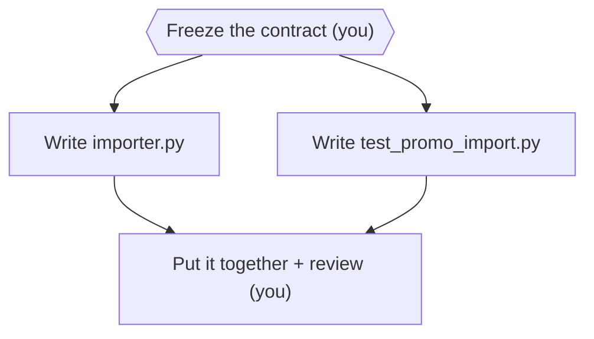

# Module 1 — Task surgery

> 🎯 **Goal:** turn TICKET-001 into tasks an agent can do **alone, without guessing**.
>
> **You'll leave with:** `workshop/plan.md` + two task cards. Modules 2–4 use all three.

---

## Why this module?

In Exercise 0, the vague prompt worked **only because the ticket did the deciding**.

- Most repos have no ticket like that
- So the agent guesses: columns, duplicates, errors, which files to touch
- You find out what it guessed at midnight

> **Today you do the deciding, and write it down.**

---

## The one rule

**Before you hand off a task, write down what it must produce and how you'll check it's done.**

| Bad | Good |
|---|---|
| "Build the importer." | **Outcome:** `src/panic_pantry/importer.py`, meeting TICKET-001 |
| | **In scope:** that file only |
| | **Check:** `python3 -m unittest tests.test_importer_contract -v` |

> Three lines. The agent knows what to make, what it may touch, and how it's judged.

---

## Words you'll need

| Word | Means |
|---|---|
| **Contract** | What every task builds against: `import_promotions(csv_path, service) -> ImportReport` + the edge cases in TICKET-001 |
| **Freeze** | Declare the contract final **before** work starts. No agent changes it |
| **Task card** | The written spec for one task (`workshop/cards/*.md`) |
| **Task packet** | Everything you **send**: the card plus the contract text, file paths, and checks. The helper can't see your files or your chat |
| **Critical path** | The chain of tasks that sets the finish time. Late on it = late launch |

---

## The plan as a picture



*Figure 2 — Nothing starts until the contract is frozen. Then the two build tasks run side by side.*
Text alternative: "freeze the contract" leads to two parallel tasks, writing the importer and writing new tests, which both lead to "put it together and review."

- **You keep** freezing and putting it together. They need the whole picture
- **You delegate** the two build tasks. Each has its own file and its own check
- The freeze is on the **critical path**. Both tasks read the contract; neither writes it

> **Split work by what it produces, not by job title.** "You are a senior test engineer" is a costume.

---

## Exercise 1 — Task surgery (10 min) 🔨

```bash
cd sandbox/panic-pantry      # main checkout, tag starter (NOT a worktree)
mkdir -p workshop/cards
```

You may only edit `workshop/plan.md` and `workshop/cards/*.md`.

### Step 1 — Save the plan (2 min)

Save this as `workshop/plan.md`. Fill in the **two blanks**.

```markdown
# Plan — TICKET-001 importer

## Contract
Frozen: tickets/TICKET-001.md, "Acceptance criteria" 1–9. Do not change.
Policy: discounts above 20% need approval; exactly 20% is active.

## Tasks
| ID | Owner | Produces | Check |
|---|---|---|---|
| T0 freeze | me | this plan | reviewed before launch |
| T1 csv_parser | implementer | src/panic_pantry/importer.py | python3 -m unittest tests.test_importer_contract -v |
| T2 import_tests | test author | tests/test_promo_import.py | python3 -m unittest tests.test_promo_import -v |
| T3 integrate | me | merged, reviewed diff | python3 -m unittest discover -s tests -v |

## Order
T0 → (T1 and T2 side by side) → T3
Critical path: ____ (which task, if late, delays everything?)
Why I keep T0 and T3: ____
```

### Step 2 — Save the first card (1 min)

This one's done for you. Save it as `workshop/cards/csv_parser.md`:

```markdown
## T1 — csv_parser: write the importer
Outcome: src/panic_pantry/importer.py with import_promotions(csv_path, service) -> ImportReport, meeting every acceptance criterion in tickets/TICKET-001.md.
Why this task is separate: one file, one check; frees me to integrate.
Inputs and source paths: tickets/TICKET-001.md; src/panic_pantry/promotions.py; src/panic_pantry/models.py; fixtures/promos_clean.csv; fixtures/promos_messy.csv.
Contract: TICKET-001 criteria 1–9, copied word for word. Duplicates include codes already in the store (WELCOME10, STAFF-PICK, MIDNIGHT-VIP, BIGSPENDER). Let the service decide approval; never compare against 20 yourself.
In scope: src/panic_pantry/importer.py only.
Out of scope: tests/test_importer_contract.py, fixtures/, data/promotions.json.seed, scripts/, every other file.
Dependencies: T0.
Acceptance checks: python3 -m unittest tests.test_importer_contract -v
Permissions/model: TBD
Return format: summary, changed paths, checks run, findings, uncertainties
```

### Step 3 — Write the second card yourself (7 min)

Copy the card above into `workshop/cards/import_tests.md`. Change it for **T2: writing `tests/test_promo_import.py`**.

- **Outcome, In scope, Check** → point them at the test file
- **Dependencies** → T0 only. The test author must **not** read the importer's code. Why?
- Keep **Out of scope** and **`Permissions/model: TBD`** as they are. You'll fill in TBD after Modules 2 and 3

### Done when

- [ ] The two cards' **In scope** files don't overlap
- [ ] Both cards' **Out of scope** list the frozen files (the test, `fixtures/`, the seed data, `scripts/`)
- [ ] Every check is a **command you can run**. "Looks good" doesn't count
- [ ] Both blanks in `plan.md` are filled

> **Stuck on the critical path?** Which task do both build tasks wait for?

---

## Debrief

- Which decisions did the card force you to make that the vague prompt let you skip?
- Why must the test author **not** read the importer?

> **The card makes you decide at 2 PM, not find out at midnight.**

---

**Next:** [module-2-agent-crew.md](module-2-agent-crew.md): give your cards to agents whose limits are enforced by settings, not by asking nicely.
