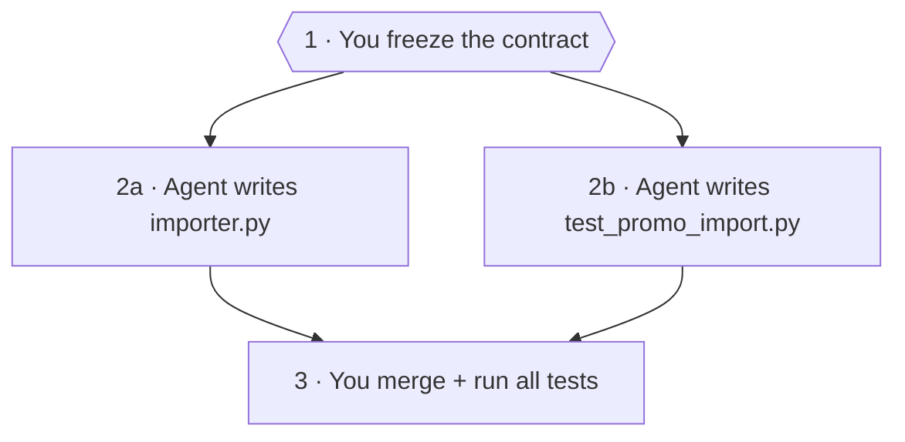

# Module 1 — Write the task cards

> 🎯 **Goal:** write a **task card** (a short spec) for each piece of the importer, so an agent knows exactly **what to build, what it may touch, and how it will be checked**.
>
> **You'll leave with:** `workshop/plan.md` + two cards. In Module 4 you hand these cards to agents.

---

## Why?

In Exercise 0, the vague prompt worked **only because the ticket had already made the decisions**.

- Most repos have no ticket like that
- So the agent guesses which columns, how duplicates work, and which files to touch
- You find out what it guessed at midnight

> **A task card writes those decisions down before the agent starts.**

---

## Where this fits

**Orchestration** = you split a job into pieces, hand each piece to an agent, then check and combine the results. The course goes through it one step at a time:

| Module | You learn to… | Orchestration step |
|---|---|---|
| **0** | Watch one agent do the whole job alone | The baseline to beat |
| **1 (here)** | Split the job and write down each piece | **Split** |
| **2** | Build agents with hard limits on what they can touch | **Staff** |
| **3** | Pick the right model for each piece | **Budget** |
| **4** | Hand the cards to agents, run them, compare with Module 0 | **Run** |
| **5** | Handle a launch-night failure | **Recover** |

- **Module 0 showed the problem:** one agent with a vague prompt only did well because the ticket did the thinking
- **This module is the fix:** *you* do the thinking, once, on paper
- **Everything later depends on it.** Agents in Module 2 are built for these cards. Module 3 tests models on this plan. Module 4 pastes these cards into delegations

> **Orchestration is mostly writing.** Bad cards in, bad agents out, no matter how good the model is.

---

## The one rule

**Before you hand off a task, write down what it must produce and how you'll check it's done.**

| Bad | Good |
|---|---|
| "Build the importer." | **Outcome:** `src/panic_pantry/importer.py`, meeting TICKET-001 |
| | **In scope:** that file only |
| | **Check:** `python3 -m unittest tests.test_importer_contract -v` |

> Three lines. The agent knows what to make, what it may touch, and how it's judged.

---

## Where do the two pieces come from?

The ticket asks for **one** thing: `src/panic_pantry/importer.py`. So why two cards?

**The rule: split where you get separate files that don't need each other.**

- **Piece 1, the importer.** It's one small file. Two agents editing it at once would collide, so it stays one piece
- **Piece 2, a second set of tests:** `tests/test_promo_import.py`. **The ticket doesn't ask for this. You add it.** It's written from the ticket alone, by an agent that never sees the importer

**Why more tests?** `tests/test_importer_contract.py` already exists, but one person wrote it from one reading of the ticket.

- A second writer reading only the ticket catches what the first one missed
- If the two sets of tests disagree, the ticket has a gap. Better to find it now than at midnight
- Same reason a teammate reviews your PR instead of you

> **Piece 1 builds it. Piece 2 checks it, independently.** Different files, no shared work, so they can run at the same time.

---

## How the work splits



*Figure 2 — You decide first, two agents build at the same time, you check at the end.*
Text alternative: step 1, you freeze the contract. Step 2, two agents work at the same time, one writing the importer and one writing tests. Step 3, you merge and run all tests.

- **Contract** = the rules both tasks build against: the 9 acceptance criteria in `tickets/TICKET-001.md`
- **Freeze** = declare those rules final. Nobody changes them mid-run
- **Why freeze first?** Both agents build against the contract. Change it halfway and both are wrong
- **Why can 2a and 2b run at the same time?** Each writes a different file, and neither needs the other's file

---

## What's on a card

Each line answers one question an agent would otherwise guess at.

| Line | Answers |
|---|---|
| **Outcome** | What does "done" produce? |
| **Inputs** | What should it read first? |
| **Contract** | What rules must it follow? |
| **In scope** | Which files may it change? |
| **Out of scope** | What must it never touch? |
| **Dependencies** | What must finish before it starts? |
| **Acceptance checks** | What command proves it's done? |

The other lines (`Why separate`, `Permissions/model`, `Return format`) you just copy for now.

> **The agent can't open your files or read your chat.** When you hand off a card, you paste the whole thing into the message. That message is called a **task packet**.

---

## Exercise 1 — Write the cards (10 min) 🔨

```bash
cd sandbox/panic-pantry      # main checkout, tag starter (NOT a worktree)
mkdir -p workshop/cards
```

You only create files in `workshop/`.

### Plan vs. cards

| | `plan.md` | A card |
|---|---|---|
| **Read by** | You | One agent |
| **Covers** | The whole job | One piece |
| **Holds** | Your own jobs (freeze first, merge last), which pieces run at the same time | Only what that agent needs to work alone |

> **The plan is for you: the whole picture. Cards are for agents: one task each, nothing extra.**

### Step 1 — Save the plan (1 min)

Copy this into `workshop/plan.md` as is. It records the split above. Module 3 asks a model to find the risks in it.

```markdown
# Plan — TICKET-001 importer

## Contract (frozen)
tickets/TICKET-001.md, acceptance criteria 1–9. Nobody changes it.
Policy: discounts above 20% need approval; exactly 20% is active.

## Me
- Before: freeze the contract (this file).
- After: merge both files, then run python3 -m unittest discover -s tests -v

## Handed off (run at the same time)
| Card | Who | Makes | Check |
|---|---|---|---|
| T1 csv_parser | implementer agent | src/panic_pantry/importer.py | python3 -m unittest tests.test_importer_contract -v |
| T2 import_tests | test-author agent | tests/test_promo_import.py | python3 -m unittest tests.test_promo_import -v |
```

(You build these agents in Module 2.)

### Step 2 — Save the first card (1 min)

This one is done for you. Copy it into `workshop/cards/csv_parser.md`:

```markdown
## T1 — csv_parser: write the importer
Outcome: src/panic_pantry/importer.py with import_promotions(csv_path, service) -> ImportReport, meeting every acceptance criterion in tickets/TICKET-001.md.
Why this task is separate: one file, one check.
Inputs and source paths: tickets/TICKET-001.md; src/panic_pantry/promotions.py; src/panic_pantry/models.py; fixtures/promos_clean.csv; fixtures/promos_messy.csv.
Contract: TICKET-001 criteria 1–9, copied word for word. Duplicates include codes already in the store (WELCOME10, STAFF-PICK, MIDNIGHT-VIP, BIGSPENDER). Let the service decide approval; never compare against 20 yourself.
In scope: src/panic_pantry/importer.py only.
Out of scope: tests/test_importer_contract.py, fixtures/, data/promotions.json.seed, scripts/, every other file.
Dependencies: contract frozen.
Acceptance checks: python3 -m unittest tests.test_importer_contract -v
Permissions/model: TBD
Return format: summary, changed paths, checks run, findings, uncertainties
```

### Step 3 — Write the second card yourself (8 min)

Copy the card above into `workshop/cards/import_tests.md`. Then change **only these five lines**:

| Line | T1 (importer) says | Change it for T2 (tests) to… |
|---|---|---|
| **Title** | `T1 — csv_parser: write the importer` | `T2 — import_tests: …` |
| **Outcome** | `importer.py` meeting TICKET-001 | the new test file, testing every criterion |
| **Inputs** | the ticket, the source files, the fixtures | the ticket and fixtures only. **Not** `importer.py` |
| **In scope** | `importer.py` only | ? |
| **Acceptance checks** | the contract test command | ? (hint: it's in your plan) |

Leave every other line the same, including `Permissions/model: TBD`. You'll fill that in after Modules 2 and 3.

### Done when

- [ ] The two cards' **In scope** lines name **different** files
- [ ] Neither card lets the agent edit `tests/test_importer_contract.py`, `fixtures/`, the seed data, or `scripts/`
- [ ] Each **Acceptance checks** line is a command you could paste into a terminal

---

## Debrief

<details>
<summary><b>Why must the test author not read <code>importer.py</code>?</b></summary>

Tests should check what the **ticket** says, not what the importer happens to do. If the test author copies the importer's behavior, its bugs become "expected."
</details>

<details>
<summary><b>Why do the two cards need different "In scope" files?</b></summary>

So the two agents can work at the same time without overwriting each other. Same file = collision.
</details>

<details>
<summary><b>Why lock the test, fixtures, seed data, and scripts?</b></summary>

They're how "done" gets measured. An agent that edits them can make broken code look finished.
</details>

> **The card makes you decide at 2 PM, instead of finding out at midnight what the agent decided.**

---

**Next:** [module-2-agent-crew.md](module-2-agent-crew.md): build the agents that will receive these cards, with limits enforced by settings, not by asking nicely.
