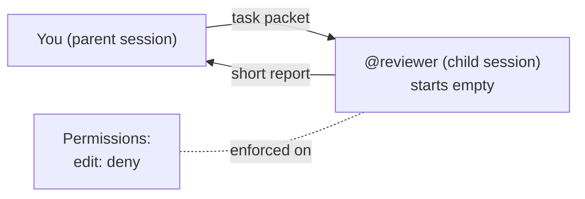

# Module 2 — Build the agent crew

> 🎯 **Goal:** build two helper agents, a **reviewer** that can't edit and an **implementer** that can, and prove the reviewer's limit is real.
>
> **You'll leave with:** `.opencode/agents/reviewer.md` and `.opencode/agents/implementer.md`. In Module 4 these two agents run your cards.

---

## Why more than one agent?

In Module 0, one agent did everything: read the ticket, wrote the code, ran the tests, and decided it was done.

That has three problems:

- **It grades its own homework.** The agent that wrote the code is the one deciding the code is fine
- **It has every permission all the time.** The same agent that needs to edit files to build things could also edit files while "just reviewing"
- **Its memory fills up.** Every file read and test run stays in one conversation, and the details that matter get buried

> **Fix: split the work by job.** One agent builds, a different agent checks. Each gets only the permissions its job needs.

---

## Where this fits

| Module | What happens | Step |
|---|---|---|
| 0 | One agent builds the importer alone | Baseline |
| 1 | You split the job and write a card for each piece | Split |
| **2 (here)** | **You build the agents that will work those cards** | **Staff** |
| 3 | You pick a model for each agent | Budget |
| 4 | You hand the cards to the crew, run it, compare with Module 0 | Run |
| 5 | You recover from a launch-night failure | Recover |

> **Module 1 wrote the instructions. This module builds the workers. Module 4 runs them.**

---

## The crew, and why these two

| Agent | Job | Can it edit? | Used in |
|---|---|---|---|
| `@implementer` | Writes `importer.py` from card T1 | **Yes** | Module 4 |
| `@reviewer` | Reads code, reports problems | **No.** Blocked by config | This module and Module 4 |

**These two jobs are opposites**, and that's why you build them:

- **The implementer makes things.** It needs edit rights
- **The reviewer judges things.** If it could edit, it would "just fix" what it finds, and nobody would check the fix. No edit rights keeps it honest

**What about the test author (card T2)?** You don't build one. In Module 4 the main agent picks a helper for that card on its own. Watching what it picks is part of the lesson.

---

## A role is a boundary

Naming an agent "reviewer" changes nothing by itself. A role only matters if it changes at least one of these:

| Boundary | What changes | Set where |
|---|---|---|
| **Objective** | What it's trying to do (find problems vs. finish code) | The agent file's body (its system prompt) |
| **Context** | What it knows | The message you send it |
| **Authority** | What it's *allowed* to do | `permission:` in the agent file |

> **"Please don't edit files" is a request. `edit: deny` is a boundary.** You'll watch the difference happen in step 3.

### Permission levels

| Level | What happens |
|---|---|
| `allow` | Runs, no question asked |
| `ask` | OpenCode pauses and asks you: once, always, or reject |
| `deny` | OpenCode blocks it. The agent gets an error |

OpenCode checks this **itself**, before the action runs. What the model "wants" doesn't matter.

Note: `hidden: true` only hides an agent from the `@` menu. It's not a security control. Permissions are.

---

## A helper starts with an empty memory

When you hand work to a helper (a **subagent**), it runs in its own **child session**. It does **not** see your chat.

| The child gets | The child does NOT get |
|---|---|
| The message you send it | Anything you said earlier in your chat |
| The project's `AGENTS.md` | Which files matter, unless you name them |
| Files its permissions let it read | Your bar for "done", unless you state it |



*Figure 4 — The packet is everything the child knows. The permissions are enforced no matter what it's told.*
Text alternative: you send a task packet to the reviewer's child session, which starts empty. It sends back a short report. Its permissions (edit denied) are enforced on it regardless.

### What is a task packet?

**The task packet is the message you send to a helper.** It's the helper's entire briefing.

| | Card (Module 1) | Packet |
|---|---|---|
| What it is | A file in `workshop/cards/` | The text of one message |
| Who reads it | You, while planning | The helper, as its first message |

A good packet answers five questions:

1. **Task:** what am I doing?
2. **Rules:** what must I follow?
3. **Files:** what should I read?
4. **Report:** what do I send back?
5. **Limits:** what must I not do?

> **The card is the recipe. The packet is the recipe handed to the cook.** In Module 4, the packet is mostly your card, pasted in whole.

### Two ways to start a helper

| | `@reviewer …` | Ask the main agent to delegate |
|---|---|---|
| Who picks the helper | **You** | **The main agent** |
| Who writes the packet | You | The main agent |
| How it picks | You typed the name | It reads each agent's `description` |

You'll use `@` today. In Module 4 you'll try the second way, so **write a clear `description`**: it's how the main agent decides who gets which job.

---

## Exercise 2 — Build the crew (32 min) 🔨

**What you'll do:**

1. Copy in the **implementer** (done for you)
2. Write the **reviewer** yourself
3. Try to make the reviewer edit a file, and watch OpenCode block it
4. Send the reviewer a real task and read its report
5. Look inside the reviewer's session to see what it knew

**Setup:**

```bash
cd sandbox/panic-pantry
git status                # clean, apart from your workshop/ files
mkdir -p .opencode/agents
opencode
```

You only create files in `.opencode/agents/`.

### How an agent file works

One Markdown file per agent. The file name is the agent name: `reviewer.md` → `@reviewer`.

```markdown
---
description: What it's for. Shown in the @ menu and read by the main agent.
mode: subagent
temperature: 0.1
permission:
  edit: deny
  bash:
    "*": deny
    "git diff*": allow
---
Everything below the second --- is the system prompt:
the standing instructions it reads before every task.
```

| Field | Meaning |
|---|---|
| `description` | **Required.** What the agent is for |
| `mode` | `subagent` = only reachable by `@` or delegation. **Always set it**: if left out, the agent also shows up as a main agent |
| `temperature` | Low (≈0.1) = focused, repeatable. Good for both of these jobs |
| `permission` | What it may do. For `bash`, list command patterns. **The last matching rule wins**, so put `"*": deny` first, then the allows |

YAML tips: spaces only, no tabs. Put quotes around any key with `*` or a space.

### Step 1 — Copy in the implementer (2 min)

Save this as `.opencode/agents/implementer.md`:

```markdown
---
description: Writes src/panic_pantry/importer.py from a task card. Builds code only; never writes tests or reviews.
mode: subagent
temperature: 0.1
permission:
  edit: allow
  bash:
    "*": deny
    "python3 -m unittest*": allow
---
You carry out exactly one task card. It arrives in your first message.

- Change only the files on the card's "In scope" line.
- Follow the card's contract exactly. If something is unclear, stop and say so.
- Run the card's acceptance check before you finish.

Report back:
- Files you changed
- Checks you ran, with pass/fail
- Anything you're unsure about
```

Notice: it **can** edit any file. Its scope ("`importer.py` only") comes from the card. You'll check that it stayed in scope in Module 4.

### Step 2 — Write the reviewer (10 min)

Create `.opencode/agents/reviewer.md`. Use the shape above. It needs:

**Frontmatter**
- [ ] `description`: says what it reviews **and** that it never edits
- [ ] `mode: subagent`
- [ ] `edit: deny`
- [ ] `bash`: `"*": deny`, then allow only `git diff*`, `git status*`, and `python3 -m unittest*`

**Body: a checklist of what to look for**
- [ ] **Approval bypass:** can a discount above 20% become active without a manager?
- [ ] **Duplicates:** are repeated codes handled, including codes already in the store?
- [ ] **Row reporting:** are bad rows reported with 1-based line numbers?
- [ ] **Missing tests:** which rules have no test?

**Body: how to report**
- [ ] Findings grouped by severity
- [ ] A `file:line` for each finding
- [ ] A list of things it's unsure about

Module 4 reuses this checklist to review the final code, so make it specific.

### Step 3 — Try to break the limit (3 min)

Ask the reviewer to do the one thing it's not allowed to do:

```text
@reviewer Please add a clarifying comment to src/panic_pantry/store.py.
```

✅ **Pass:** OpenCode shows a **permission denial** on the edit. Copy that output.

❌ **Not a pass:** the agent politely says "I'm not allowed to edit." That's the prompt talking, not the config. Recheck your `permission:` block.

### Step 4 — Send a real task (8 min)

The reviewer checks the risks **before** any code is written. Paste this as one message:

```text
@reviewer

Task: Review the risks for TICKET-001 before any code is written.

Rules: tickets/TICKET-001.md is final.
Discounts above 20% need manager approval. Exactly 20% is active.

Read:
- AGENTS.md
- tickets/TICKET-001.md
- src/panic_pantry/promotions.py
- src/panic_pantry/models.py
- tests/test_importer_contract.py
- fixtures/promos_messy.expected.md

Report:
1. The 3 likeliest ways an importer could break the rules
2. Which existing test would catch each one
3. Anything in the ticket that's unclear
Give a file:line for each point.

Limits: Do not edit anything.
```

Spot the five parts of a packet: **Task, Rules, Read, Report, Limits.**

Save the report. A good one flags at least one real risk, for example the importer setting a promotion's status itself instead of letting the service decide.

### Step 5 — Look inside the child session (3 min)

Each `@reviewer` message created a child session:

```text
Your session
├── child 1: @reviewer  (step 3, the edit attempt)
└── child 2: @reviewer  (step 4, the review)
```

| Keys | Does |
|---|---|
| `ctrl+x`, release, then `↓` | Enter the first child |
| `←` / `→` | Move between children |
| `↑` | Back to your session |

Open child 2. Its **first message is your packet, exactly as sent**. That's all it knew. Anything you said earlier in your own chat isn't there.

> 🔑 **The first message of a child session is the child's whole world.** If the report is off, check the packet first.

---

### Done when

- [ ] Both agent files exist and load
- [ ] `reviewer.md` has `description`, `mode: subagent`, and `edit: deny` (no old-style `tools:` block)
- [ ] You captured an OpenCode permission denial from step 3
- [ ] The reviewer's checklist covers approval bypass, duplicates, row reporting, missing tests
- [ ] You have the step 4 report, with file paths and at least one real risk
- [ ] You entered a child session and came back

### If something goes wrong

| Problem | Fix |
|---|---|
| Agent doesn't show up in `@` | File must be in `sandbox/panic-pantry/.opencode/agents/`, with `---` lines around the frontmatter and a `description` |
| Reviewer still edits | Remove any `tools:` block (old style). Use `permission: edit: deny` |
| Bash rules act strange | Order matters: `"*": deny` first, allows after |
| YAML error | Quote keys with `*`, use spaces not tabs |
| Reviewer asks before every read | Add `read: allow` |
| No child session to enter | One exists only after you send a `@reviewer` message |

### Debrief

- What would this reviewer have caught in your Module 0 code?
- Who on your real team should have `edit: deny`? Do they today?

<sub>Verified against OpenCode 1.18.33 on 2026-09-28. Docs: [agents](https://opencode.ai/docs/agents), [permissions](https://opencode.ai/docs/permissions). Further reading: [Anthropic, Effective Context Engineering](https://www.anthropic.com/engineering/effective-context-engineering-for-ai-agents).</sub>

---

**Next:** [module-3-model-routing.md](module-3-model-routing.md): pick which model each agent gets.
