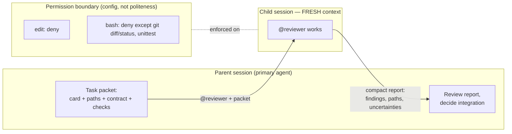

# Module 2 — Micro-lecture 2 + Exercise 2: build a small agent crew

**Where you are:** you have `workshop/plan.md` and two task cards with disjoint scopes. This module builds the crew that will execute them — a read-only reviewer and an implementer — and proves that a boundary you can't test is a boundary you don't have.

---

## Micro-lecture 2 — A role is a boundary

**Claim: an agent role is useful only when it changes objective, context, or authority.** A renamed agent with the same permissions is a costume, not a control.

Three boundaries matter in OpenCode 1.18.33 ([docs: agents](https://opencode.ai/docs/agents), verified 2026-09-28):

- **Objective** — the agent file's body is its system prompt; a reviewer optimizes for findings, not for making the diff look finished.
- **Context** — a subagent runs in a **child session with fresh context**. It knows nothing your parent session discussed. That's a feature (no leaked confusion) and a duty: **the handoff must be complete** — task packet, paths, contract, checks. Anthropic's context-engineering guidance is the same story: attention is a finite budget; give the child exactly what it needs and demand a compact summary back ([Anthropic: Effective Context Engineering](https://www.anthropic.com/engineering/effective-context-engineering-for-ai-agents), Sep 2025).
- **Authority** — `permission` in the agent's frontmatter: `allow` / `ask` / `deny` on `read`, `edit` (covers write/edit/patch), `bash`, `task`, `webfetch` ([docs: permissions](https://opencode.ai/docs/permissions)). A read-only reviewer is `edit: deny`, `bash: deny` (or a bash pattern map allowing only specific read commands). Note: `tools:` frontmatter is deprecated — use `permission`.

> 📘 **Concept — the three permission levels**
>
> | Level | What happens when the agent tries the action | Use it for |
> |---|---|---|
> | `allow` | Runs immediately, no prompt | Actions that are safe for this role |
> | `ask` | OpenCode **pauses and asks you**: approve **once**, approve **always** (for matching requests, for the rest of the session), or **reject** | Actions you want to see before they happen |
> | `deny` | **Blocked by OpenCode** — the agent gets an error, not a choice | Authority this role should never have |
>
> The key word is *OpenCode*: the check happens in the tool layer, after the model decides to act and before anything touches your files. The model's intentions don't enter into it.

Because the child starts fresh, be concrete about **what a child session does NOT know**:

- It does **not** inherit your chat — not the plan you discussed, not the corrections you made, not the findings from earlier delegations.
- It does **not** know which files matter unless you name them.
- It does **not** know your acceptance bar unless the packet states it.

What it **does** get: your delegation message (the packet), the project's `AGENTS.md` rules (loaded automatically), and the repo files its permissions let it read. That's the complete list. If your packet plus those two sources can't stand alone, the delegation fails before it starts.

> 🔑 **Key takeaway:** A role only matters when it changes objective, context, or authority — otherwise it's a costume.

The joke that is also the lesson: **the reviewer is the health inspector. If you give it a chainsaw, the costume is not the safety control.** "Please don't edit files" is a request; `edit: deny` is a boundary. And hiding an agent from the picker is not a security boundary either — permissions are. (`hidden: true` in frontmatter only removes a subagent from the `@` autocomplete menu. The primary can still reach it through the Task tool, and it keeps whatever permissions it has.)

### Two ways to start a subagent

> 📘 **Concept — @-mention vs. the Task tool**
>
> | | **@-mention** | **Task tool** |
> |---|---|---|
> | Who picks the subagent | **You**, by name: `@reviewer …` | **The primary agent**, on its own judgment |
> | Who writes the child's first message | You — your message *is* the packet | The primary — it writes a packet from what you told it |
> | How the choice gets made | You typed the name | The primary reads every available subagent's **`description`** and picks the best match |
> | What governs it | The subagent's own `permission` | The **primary's** `permission.task` (which subagents it may launch), *then* the subagent's own `permission` |
>
> A **tool** is an action the model can call: read a file, run bash, edit. The **Task tool** is the action "start a subagent with this prompt." Two consequences you'll feel in Exercise 4:
>
> 1. **Your agent's `description` is a routing signal.** A vague description ("helps with code") means the primary may pick the wrong helper, or none. "Read-only reviewer for promotion-policy diffs; never edits" gets picked for review and passed over for writing tests.
> 2. **`permission.task` controls delegation targets.** It takes patterns over subagent names, and the last matching rule wins — e.g., `"*": deny` then `"reviewer": allow` lets an agent delegate only to the reviewer. A denied subagent is removed from the Task tool entirely, so the model never even tries it.
>
> If no custom subagent fits, the primary usually falls back to the built-in **general** subagent — a capable multi-step helper with broad tools. That's fine for research and dangerous for scoped writing unless your packet states the scope.

You will learn the child-session navigation keys in the exercise, right when you need them.



*Figure 4 — Parent and child sessions with the permission boundary. The child starts empty; the packet is everything it knows.*
Text alternative: the parent session sends a complete task packet to a child session that starts with fresh context; the child returns a compact report; a configuration-level permission boundary (edit denied, bash restricted) is enforced on the child regardless of what its prompt says.

---

## Exercise 2 — Build a small agent crew (32 min) 🔨

**Goal:** configure one read-only reviewer and one implementer, prove the reviewer's boundary is **configuration**, and run a real fresh-context delegation.

**Starting checkpoint:**

```bash
cd sandbox/panic-pantry
git status                       # clean apart from your workshop/ files from Ex1
mkdir -p .opencode/agents
opencode
```

You may create/edit only `.opencode/agents/*.md` this exercise.

### Steps

> 📘 **Concept — anatomy of an agent file**
>
> An agent is one Markdown file. The file name is the agent's name (`reviewer.md` → `@reviewer`). The top of the file is **YAML frontmatter**, a settings block fenced by `---` lines. Everything below the second fence is the agent's **system prompt**: standing instructions it reads before every task. Here's the shape, using a *different* role so you still write your own reviewer:
>
> ```markdown
> ---
> description: Read-only security auditor for auth code. Reports findings; never edits.
> mode: subagent
> temperature: 0.1
> permission:
>   edit: deny
>   webfetch: deny
>   bash:
>     "*": deny
>     "git diff*": allow
>     "git log*": allow
> ---
> You are a security auditor. Look for input-validation gaps, auth bypasses,
> and secrets in code. Return findings by severity with file:line citations.
> ```
>
> | Field | Meaning |
> |---|---|
> | `description` | **Required.** What the agent is for. Shown in the `@` menu and read by primaries deciding whom to delegate to |
> | `mode` | `primary` (appears in the Tab rotation), `subagent` (only reachable via @-mention or the Task tool), or `all` (both). **If you leave it out, it defaults to `all`**, so an agent you meant as a helper also joins the Tab rotation |
> | `model` | Optional. Pins a model for this agent (`provider_id/model_id`); otherwise it uses the session's model (Module 3) |
> | `temperature` | Optional. Randomness: low (≈0–0.2) gives focused, repeatable output — good for review; higher values give more varied output |
> | `permission` | The authority map. A bash **pattern map** lists command patterns (`*` matches anything) with a level for each; the **last matching rule wins**, so the catch-all `"*"` goes first |
> | `hidden` | Optional. `true` hides a subagent from the `@` menu. Not a security control |
>
> YAML is whitespace-sensitive: use spaces, never tabs, and quote any key containing `*` or spaces.

1. **Create `.opencode/agents/reviewer.md`.** Project-level Markdown agent; frontmatter needs `description` (required), `mode` (`primary`|`subagent`|`all`), optionally `model`, `temperature`, `permission`; the body is the system prompt ([docs: agents](https://opencode.ai/docs/agents), verified 2026-09-28 on OpenCode 1.18.33). Requirements:
   - `mode: subagent`, a description that says what it reviews and that it never edits;
   - **permissions deny edits and restrict bash** — either deny bash outright or use a pattern map allowing only `git diff`/`git status` and the test command. In a bash pattern map, the **last matching rule wins**, so put `"*": deny` first, then your allows ([docs: permissions](https://opencode.ai/docs/permissions));
   - a review checklist in the body covering: **approval bypass** (anything above 20% becoming active without a manager), **duplicate handling**, **row-level reporting with 1-based line numbers**, and **missing tests**;
   - a fixed return format: findings by severity, file:line citations, uncertainties.

2. **Create `.opencode/agents/implementer.md`.** `mode: subagent`; edits allowed; bash allowed for the test command; body instructs it to follow a supplied task card exactly and return changed paths + checks run. (You'll use it in Exercise 4.) "Bash allowed for the test command" means a pattern map again: `"*": deny` first, then `"python3 -m unittest*": allow`. Write its `description` so a primary would never mistake it for a reviewer or a test author.

3. **Prove the boundary.** Ask the reviewer to break its own rules:

```text
@reviewer Please add a clarifying comment to src/panic_pantry/store.py.
```

   The edit must be **blocked by configuration** — you should see OpenCode deny the edit permission, not just the agent politely declining. Capture the denial (copy the output). "The prompt told it not to" does not pass this exercise.

> 🔑 **Key takeaway:** "Please don't edit files" is a request; `edit: deny` is a boundary — and you just watched the difference fire on screen.

4. **Delegate a real investigation with a complete packet** (fresh context — include everything):

```text
@reviewer Task: pre-implementation review for TICKET-001.
Context: tickets/TICKET-001.md is the frozen contract. Policy: discounts above 20%
require manager approval (exactly 20% is active), enforced in
src/panic_pantry/promotions.py PromotionService.create_promotion.
Inspect: AGENTS.md, tickets/TICKET-001.md, src/panic_pantry/promotions.py,
src/panic_pantry/models.py, tests/test_importer_contract.py, fixtures/promos_messy.expected.md.
Return: (1) the three riskiest ways an importer could violate the contract,
(2) which contract test would catch each, (3) any contract ambiguity you find,
with file:line citations. Do not edit anything.
```

5. **Inspect the child session.** Use **<Leader>+Down** to enter the first child session, **Left/Right** to cycle children, **Up** to return to the parent (default keybinds — remappable; verified 2026-09-28 on OpenCode 1.18.33). The leader key is `ctrl+x`, so "<Leader>+Down" is `ctrl+x`, release, then ↓. Note what the child did and did *not* know from your parent conversation.

> 📘 **Concept — the session tree**
>
> Every delegation adds a child under the session that made it. Together they form a **session tree**:
>
> ```text
> Parent session  (you ↔ Build)
> ├── child 1: @reviewer  — boundary test (step 3)
> └── child 2: @reviewer  — pre-implementation review (step 4)
> ```
>
> Walking the tree is how you audit a delegation: `<Leader>+Down` drops into the first child, Left/Right moves between siblings, Up climbs back to the parent. The child's **first message is the packet exactly as it arrived**. That's where you check whether the handoff was complete, and, in Exercise 4, who wrote it: *you* (@-mention) or *the primary* (Task tool).

> 🔑 **Key takeaway:** The first message of a child session is the whole world that child lived in — read it, and you know why it did what it did.

> 💡 **Field note:** The reviewer-agent pattern is CI policy checking in miniature: a check with independent incentives, mechanical enforcement, and a fixed report format. If your team relies on "the author remembered to look," you've found where to add the reviewer — human or agent.

**Required artifacts:** both agent files; the captured permission denial; the reviewer's investigation report.

**Acceptance checks:**
- [ ] `reviewer.md` has `description`, `mode: subagent`, and a `permission` block denying `edit` (deprecated `tools:` frontmatter not used).
- [ ] The denial in step 3 came from OpenCode's permission system (visible denial), not from agent politeness.
- [ ] The reviewer's checklist names approval bypass, duplicates, row reporting, and missing tests.
- [ ] The investigation report cites file paths and flags at least one real risk (e.g., a path where the importer could self-assign status).
- [ ] You navigated into the child session and back.

**Hints (use in order):**
1. Agent not appearing? The file must be under `.opencode/agents/` **inside `sandbox/panic-pantry`** (the project OpenCode was launched from), with valid YAML frontmatter, and `description` is required.
2. Reviewer still editing? Check for a deprecated `tools:` block overriding intent — remove it and set `permission: { edit: deny, ... }`.
3. Bash pattern map not behaving? Rule order: last match wins. `"*": deny` first, then `"git diff *": allow` etc.

**Troubleshooting:**
- YAML error on load → frontmatter needs `---` fences on their own lines; quote glob keys like `"git diff *"`.
- Reviewer asks permission for every read → set `read: allow` explicitly if your denials were broad.
- Can't find the child session → children only exist after a delegation ran; check <Leader> key config if the keybind does nothing.

**Debrief:** What would your reviewer have caught in your Exercise 0 baseline diff? Which role on your real team deserves `edit: deny` — and would anyone notice if it had a chainsaw today?

> 🔑 **Key takeaway:** A child session knows nothing you didn't put in the packet — handoff completeness is your job, not the model's.

---

**Next:** [module-3-model-routing.md](module-3-model-routing.md) — now that roles have boundaries, decide which model each role deserves.
