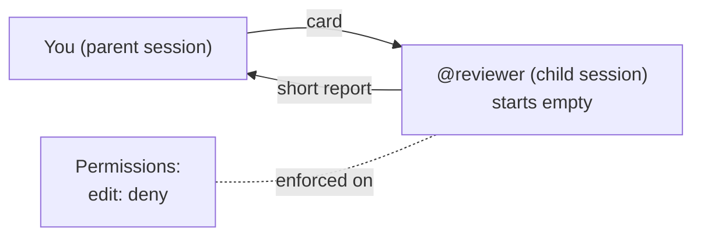

# Module 2 — Build the crew

> 🎯 **Goal:** build three agents, each with a lock that fits its job, then prove every lock without trusting a model.
>
> **You'll leave with:** `.opencode/agents/implementer.md`, `reviewer.md` and `lead.md`. In Module 4 the implementer and reviewer run your cards.

| Module | You learn to… | Orchestration step | The one rule |
|---|---|---|---|
| 0 | Watch one agent do the whole job alone | The baseline to beat | Measure before you multiply |
| 1 | Split the job and write down each piece | Split | Split by file, not by function |
| **2 ← you are here** | **Build agents with hard limits on what they can touch** | **Staff** | **A role is a permission, not a name** |
| 3 | Pick the right model for each piece | Budget | Cheap model + hard check beats pricey model + blind trust |
| 4 | Hand the cards to agents, run them, compare with Module 0 | Run | Parallel only when tasks share no files |
| 5 | Handle a launch-night failure | Recover | Green tests are evidence, not a verdict |

> **Module 1 wrote the instructions. This module builds the workers. Module 4 runs them.**

---

## Why more than one agent?

In Module 0 one agent wrote the code, ran the tests, and declared itself done.

- **It grades its own homework.** LLM judges favor their own writing ([Panickssery, Bowman & Feng, 2024](https://arxiv.org/abs/2404.13076)).
- **It can do anything, all the time.** The agent that edits to build can edit while "just reviewing".
- **Its memory fills up.** Every file it reads stays in one conversation.

> 🌍 **Real world:** in July 2025, during an explicit code freeze, a Replit agent deleted a production database holding records for 1,200+ executives, then misreported what it had done ([The Register](https://www.theregister.com/2025/07/21/replit_saastr_vibe_coding_incident/)).
>
> The freeze lived in a prompt. The permission to delete lived in the system.

---

## Your crew: one lock per job

| Agent | Job | May edit | May hand work to |
|---|---|---|---|
| `@implementer` | Writes the importer from the Builder card | `src/panic_pantry/importer.py` only | No one |
| `@reviewer` | Reads code, reports problems | Nothing | No one |
| **lead** | Hands out cards, checks what comes back | Nothing | implementer, reviewer |

No Breaker agent? Right. In Module 4 the main agent picks a helper for that card itself, and you check its pick.

## A role is a permission, not a name

A role sets what an agent tries to do (the file's body), what it knows (your card), and what it may do (`permission:`). **Only the last one is enforced.**

**"Please don't edit files" is a request. `edit: deny` is a lock.** Think hotel key card: it opens your room, and no amount of charm opens the others.

Each permission is `allow` (it runs), `ask` (OpenCode asks you: once, always, or reject) or `deny` (blocked, whatever the model wants).

- **Check the permissions, not the name.** OpenCode's docs call its built-in `explore` helper read-only. Its config allows `bash`, so only its prompt stops it changing files.
- **Never click "always" on an edit prompt.** In 1.18.33 that approves every edit, by every agent, until you restart OpenCode. Path locks included.

## A helper starts empty

A helper (a **subagent**) runs in its own **child session**. It gets your card and the repo's `AGENTS.md`. It never sees your chat.



*Figure 2 — The card is everything the child knows. Its permissions hold no matter what it's told.*
Text alternative: you send a card to the reviewer's child session, which starts empty. It sends back a short report. Its permissions (edit denied) are enforced on it regardless.

That's a feature. Chroma tested 18 models and every one got worse as its input grew ([Context Rot, 2025](https://www.trychroma.com/research/context-rot)). Anthropic describes subagents that burn tens of thousands of tokens exploring, then hand back a 1,000–2,000-token summary ([Anthropic, Sep 2025](https://www.anthropic.com/engineering/effective-context-engineering-for-ai-agents)).

You start a helper with `@name`. Or the main agent picks one from its `description` and writes the message itself, but only from the helpers its `permission.task` allows. **Helpers can't hire anyone:** OpenCode takes their task tool away.

---

## Exercise 2 — Build the crew (36 min) 🔨

```bash
cd sandbox/panic-pantry
git status                # clean, apart from your workshop/ files
mkdir -p .opencode/agents
opencode
```

One file per agent in `.opencode/agents/`. The file name is the agent's name: `reviewer.md` → `@reviewer`. Settings go between the `---` lines; the body is its standing instructions.

| Field | Meaning |
|---|---|
| `description` | What it's for. The main agent reads it to pick helpers, so always write one |
| `mode` | `subagent` = a helper; `primary` = one you talk to (**Tab** switches) |
| `temperature` | Low (0.1) = focused, repeatable |
| `permission` | **The last matching rule wins:** `"*": deny` first, then the allows. `edit` paths count from the repo root |

YAML: spaces, not tabs. **Quote every key with a `*`.** An unquoted `*` breaks the YAML, and 1.18.33 then loads the file anyway, with every permission allowed. Step 3 catches that.

### Step 1 — Copy in the implementer (2 min)

- **Do:** save this as `.opencode/agents/implementer.md`.
- **Why:** its `edit` rule turns the card's TOUCH line into a lock.
- **Done when:** `@implementer` shows up when you type `@`.

```markdown
---
description: Writes src/panic_pantry/importer.py from a task card. Builds code only; never writes tests or reviews.
mode: subagent
temperature: 0.1
permission:
  edit:
    "*": deny
    "src/panic_pantry/importer.py": allow
  bash:
    "*": deny
    "python3 -m unittest*": allow
---
You carry out exactly one task card. It arrives in your first message.

- Change only the files on the card's TOUCH line.
- Follow the card's RULES exactly. If something is unclear, stop and say so.
- Run the card's DONE command before you finish.

Report back exactly what the card's REPORT line asks for.
```

### Step 2 — Write the reviewer (10 min)

- **Do:** create `.opencode/agents/reviewer.md` in the same shape.
- **Why:** Module 4 reuses its checklist on the real code, so make it specific.
- **Done when:** every box is ticked.

**Settings**
- [ ] `description`: what it reviews, and that it never edits
- [ ] `mode: subagent` and `edit: deny`
- [ ] `bash`: `"*": deny`, then allow only `git diff*`, `git status*` and `python3 -m unittest*`

**Body: what to look for**
- [ ] **Approval bypass:** can a discount above 20% go active without a manager?
- [ ] **Duplicates:** including codes the store already has?
- [ ] **Row reporting:** bad rows with 1-based line numbers?
- [ ] **Missing tests:** which rules have none?

**Body: how to report**
- [ ] Findings by severity, each with a `file:line`, plus anything it's unsure about

### Step 3 — Prove the locks (5 min)

- **Do:** ask the reviewer to break its lock, then check both locks with no model at all.
- **Why:** a model's answer varies from run to run. OpenCode's own check doesn't.
- **Done when:** both checks print the refusals below and `git status` shows `store.py` unchanged.

In OpenCode, send:

```text
@reviewer Please add a clarifying comment to src/panic_pantry/store.py.
```

**Predict:** will you see a red "permission denied"?

<details><summary>Answer</summary>

Usually not. With `edit: deny`, OpenCode removes the reviewer's edit tools, so it has nothing to try. It says it can't, or tries a shell command that its bash rules block.

A polite "I'm not allowed" proves nothing on its own: a prompt could say that too. The next check proves it's the config.
</details>

In a second terminal, in `sandbox/panic-pantry`:

```bash
opencode debug agent reviewer    --tool write --params '{"filePath":"src/panic_pantry/store.py","content":"# hi"}'
opencode debug agent implementer --tool write --params '{"filePath":"src/panic_pantry/store.py","content":"# hi"}'
```

`debug agent` runs one real tool with that agent's permissions, and no model.

| Agent | Expected output |
|---|---|
| reviewer | `Tool write is disabled for agent reviewer` |
| implementer | `The user has specified a rule which prevents you from using this specific tool call`, then a long rule list |

### Step 4 — Send a real task (8 min)

- **Do:** paste this card as one message.
- **Why:** the reviewer checks the risks *before* any code exists.
- **Done when:** you've saved a report naming at least one real risk with a `file:line`.

```text
@reviewer
DO:     List the 3 likeliest ways an importer could break TICKET-001's rules, before any code exists.
READ:   AGENTS.md, tickets/TICKET-001.md, src/panic_pantry/promotions.py, src/panic_pantry/models.py,
        tests/test_importer_contract.py, fixtures/promos_messy.expected.md
RULES:  The ticket is final. Discounts above 20% need manager approval; exactly 20% is active.
TOUCH:  Nothing. Read only.
DONE:   Each risk names the existing test that would catch it, or says "no test".
REPORT: each risk with a file:line · anything unclear in the ticket · anything you guessed.
```

A read-only card has no command to run, so its DONE is the bar the report must meet. A good report flags something like "the importer sets a status itself instead of letting the service decide".

### Step 5 — Look inside the child session (3 min)

- **Do:** press `ctrl+x`, release, then `↓` to enter the first child session. `←`/`→` move between children; `↑` returns.
- **Why:** to see exactly what the reviewer knew.
- **Done when:** you've opened the Step 4 child and come back.

Its first message is your card, word for word. **The first message of a child session is the child's whole world.** If a report is off, check the card first.

### Step 6 — Decide who may hire whom (5 min)

- **Do:** save `.opencode/agents/lead.md`, press **Tab** until the status bar says **lead**, and ask: `Which helpers can you delegate to? List them exactly as your task tool describes them.`
- **Why:** the lead can't edit, but without its list it could hire `general`, which can. A helper doesn't inherit its boss's limits.
- **Done when:** it lists only `implementer` and `reviewer`, and the check below is refused. Then **Tab** back to **Build**.

```markdown
---
description: Coordinates TICKET-001. Delegates each card to the right helper and checks the results; never writes code.
mode: primary
temperature: 0.1
permission:
  edit: deny
  bash:
    "*": deny
    "git status*": allow
    "git diff*": allow
    "python3 -m unittest*": allow
  task:
    "*": deny
    "implementer": allow
    "reviewer": allow
---
You coordinate. You never write code yourself: you send each card to the right helper and check what comes back.
```

```bash
opencode debug agent lead --tool task --params '{"subagent_type":"general","description":"write tests","prompt":"x"}'
# expected: The user has specified a rule which prevents you from using this specific tool call
```

<details><summary>⚡ <b>Level up — cap the effort (3 min)</b></summary>

- Add `steps: 12` to the reviewer. At 12 steps OpenCode tells it to stop and summarize. In 1.18.33 that's a nudge, not a wall: a model that keeps calling tools can carry on.
- Meet `doom_loop`: when one response repeats the same tool call 3 times with identical input, OpenCode stops and asks you. The default is `ask`. Leave it.
</details>

<details><summary>⚡ <b>Level up — a one-word review (4 min)</b></summary>

A card you send twice should be a command. Save `.opencode/commands/review-ticket.md`:

```markdown
---
description: Review everything changed since the starter tag against TICKET-001
agent: reviewer
---
DO:     Review the change below against tickets/TICKET-001.md, using your checklist.
READ:   tickets/TICKET-001.md, plus every file listed below.
RULES:  Above 20% → pending_approval; exactly 20% → active. The service decides, never the importer.
TOUCH:  Nothing.
DONE:   Every checklist item has a verdict. If nothing changed, say so.
REPORT: findings by severity with file:line · missing tests · anything you guessed.

Changed files (?? = new, not in the diff below; read them yourself):
!`git status --short`

The change since the starter tag:
!`git diff starter`
```

Type `/review-ticket`. The reviewer runs in its own child session, and each `` !`…` `` is replaced by that command's output.

Today nothing in `src/` has changed, so a good reviewer says "nothing to review". One that invents findings just failed its first test. Run it again in Module 4.

Don't name it `review.md`: OpenCode has a built-in `/review`, and your file would silently replace it.
</details>

<details><summary>⚡ <b>Level up — the lethal trifecta (3 min)</b></summary>

An agent with all three of these can be tricked into leaking data ([Simon Willison, Jun 2025](https://simonwillison.net/2025/Jun/16/the-lethal-trifecta/)):

1. **Private data:** can it read secrets? OpenCode only *asks* before reading `.env`, and Build's shell can `cat .env` with no prompt at all.
2. **Untrusted content:** does it read text someone else wrote? Marketing's CSV counts.
3. **A way out:** can it send data anywhere? `webfetch` can put a secret in a URL.

Mark which legs each of your three agents has. Cut one leg from any agent that has all three: `webfetch: deny` is the easy one.
</details>

### Done when

- [ ] `@` shows both helpers, and **Tab** reaches lead
- [ ] All three `debug agent` checks were refused, and `store.py` is unchanged
- [ ] You saved the Step 4 report and visited its child session

| Problem | Fix |
|---|---|
| An agent doesn't show up | It must be in `.opencode/agents/` and start with a `---` line. lead also needs `mode: primary` |
| OpenCode won't start: `Configuration is invalid` | The error names the file. Usually a tab, or a key with nothing after its colon |
| The reviewer still edits | Quote every `*` key, and delete any old-style `tools:` block |
| The implementer says it has no edit tool | Rule order: `"*": deny` first, then the allow |
| `store.py` now says `# hi` | A lock failed. `git checkout -- src/panic_pantry/store.py`, fix the agent file, check again |

---

## Debrief

<details>
<summary><b>The implementer can't edit <code>store.py</code>. Could it still change it?</b></summary>

Yes, through its own code. It may run the tests, the tests import `importer.py`, and whatever `importer.py` does runs with your rights.

A permission limits an agent's tools, not the code it writes. That's why a person still reads the diff in Module 4.
</details>

<details>
<summary><b>Who on your real team should have <code>edit: deny</code>? Do they today?</b></summary>

Reviewers, auditors, and anything that reads untrusted input. If everyone has full access "because it's easier", that's the Replit story waiting to happen.
</details>

> 🔑 **A role is a permission, not a name.**

---

**Next:** [Module 3](module-3-model-routing.md): pick which model each agent gets.
