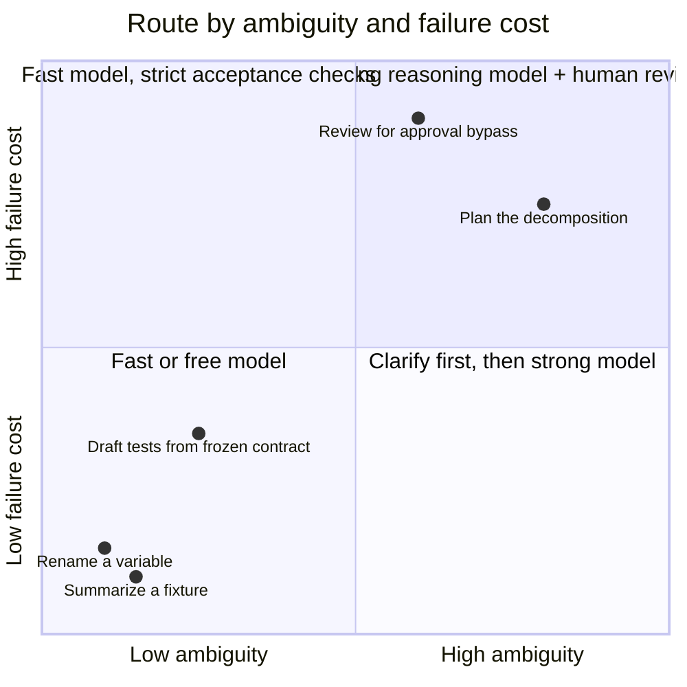

# Module 3 — Micro-lecture 3 + Exercise 3: model routing

**Where you are:** you have a plan, a Builder card and a Breaker card, and a crew with configured boundaries. This module adds the last delegation decision: which model gets which task — decided by evidence, not brand loyalty.

---

## Micro-lecture 3 — Model choice is a budget decision

**Claim: choose a model for the task's uncertainty and failure cost — then check the result.** Model selection is a hypothesis, not a permanent ranking.

Two axes decide the routing. Low-ambiguity, low-consequence work (rename, summarize, drafting tests from a *written* contract) goes to a faster or cheaper model — the acceptance check catches failures cheaply. High-ambiguity or high-consequence work (planning, policy review, debugging) may justify a stronger reasoning model, because the failure is expensive to even *detect*. Latency and cost are the tiebreakers, not the axes.



*Figure 3 — The model-routing matrix.*
Text alternative: a two-by-two grid with ambiguity on the horizontal axis and failure cost on the vertical; bounded low-risk tasks (summaries, renames, drafting tests from a frozen contract) sit low-left and route to fast/free models with strict checks; policy review and open-ended planning sit high and right and route to stronger reasoning models plus human review.

The matrix compresses into three heuristics you can apply without a whiteboard:

| Task shape | Route to | Why |
|---|---|---|
| Bounded + testable (contract written, deterministic check exists) | Fast/cheap model | the check catches failure at near-zero cost |
| Ambiguous + high-consequence (planning, debugging, risk review) | Strong reasoning model | the failure is expensive to even detect |
| Anything policy-critical (the 20% rule, money, access) | Strong model **+ human review** | the cost of a miss is the business, not the token bill |

Escalation is part of the routing: when the cheap route fails its acceptance check twice, shrink the task or route up to a stronger model — never compensate by removing the tests or the permissions that caught the failure.

> 🔑 **Key takeaway:** Route by ambiguity and failure cost; latency and price are tiebreakers, not axes.

Mechanics in OpenCode 1.18.33 (verified 2026-09-28): `/models` in the TUI opens the live catalog; config sets `"model": "provider/model_id"`; each agent file can override `model`; `opencode models` lists IDs from the CLI; `opencode stats` shows token/cost data ([docs: models](https://opencode.ai/docs/models), [docs: CLI](https://opencode.ai/docs/cli)).

> 📘 **Concept — providers, model IDs, and where the setting lives**
>
> - A **provider** is the service a model comes from: Anthropic, OpenAI, a local server, or **OpenCode Zen**. You add one with `/connect` in the TUI; your instructor has already connected this classroom's.
> - Every model has a two-part ID, **`provider_id/model_id`**, e.g. `opencode/gpt-5.1-codex`. The first part says where to send the request; the second says which model. Always record the full ID; the display name alone is ambiguous across providers.
> - The model setting can live in three places. Later ones override earlier ones:
>   1. **Global config** `~/.config/opencode/opencode.json`: your personal default.
>   2. **Project config** `opencode.json` in the repo root: the team default for this project.
>   3. **An agent's frontmatter** `model:` line: this agent only, always.
>
>   Picking a model with `/models` changes the *current session*. A `model:` line in an agent file wins for that agent regardless. That's why Exercise 4 pins the implementer's model in its file.

> 📘 **Concept — variants: the effort dial**
>
> A **variant** is a preset for the *same* model with different settings, usually how hard it thinks. Anthropic models ship variants with higher thinking budgets (e.g., *high*, *max*); OpenAI reasoning models ship reasoning-effort levels (from *none* up to *xhigh*). More effort usually means better answers on hard problems, and always means more time and tokens. Press **`ctrl+t`** to cycle variants; the status bar shows the current one. For today's comparisons, "model/effort" means **model ID + variant**: record both, keep both fixed when a run must be matched.

> 🔑 **Key takeaway:** The unit you compare is `provider_id/model_id` + variant. A display name in your notes is a vibe, not an experiment log.

> 📘 **Concept — OpenCode Zen**
>
> **Zen** is OpenCode's own provider: "a list of tested and verified models provided by the OpenCode team," behind a single account and API key. It carries both paid pay-per-request models and a rotating set of free-labeled ones.

On free models: OpenCode Zen currently lists free-labeled models (as of 2026-09-28), but they are **limited-time, may train on your data (varies per model — check the Zen model list; some are zero-retention), and require an account with billing details** — distinct from paid Zen pay-per-request models ([docs: Zen](https://opencode.ai/docs/zen)). Rule for life: **never hardcode a model name as "best."** Pick from the live `/models` catalog, in your environment, today.

---

## Exercise 3 — Model routing (32 min) 🔨

**Goal:** compare two model/effort configurations on the same tasks using observable results — not brand loyalty.

**Starting checkpoint:**

```bash
cd sandbox/panic-pantry
opencode
```

In the TUI run `/models` and note what's available. Pick **two** configurations that are actually enabled in this classroom (e.g., one free-labeled model and one stronger model; if only one model is available, compare two effort/reasoning settings if supported, or use the instructor's recorded comparison trace). Record the exact IDs as OpenCode shows them. You may edit only `workshop/model-comparison.md` (plus scratch-branch files) this exercise.

> 📘 **Concept — scratch branch**
>
> A **scratch branch** is a throwaway branch for experiments you never intend to keep. Today's tasks produce tables, not code, so you probably won't need one. If you want to try something in code, run `git switch -c scratch/ex3`, experiment, then `git switch main && git branch -D scratch/ex3` to leave the main checkout exactly as it was.

> 📘 **Concept — fresh session**
>
> A **fresh session** is a new, empty conversation: `/new` or `<Leader>+n`. The model starts with no memory of your previous runs. That's what makes a paired comparison fair: run 2 can't benefit from anything run 1 said.

### The paired run — keep task, starting state, and checks constant

**Task A (small, deterministic):** predict the **disposition** of every data row of the messy fixture: the one outcome bucket each row lands in (created-active, created-pending_approval, skipped_duplicate, or error). Run it once per model configuration, in a fresh session each time. Paste exactly:

```text
Read tickets/TICKET-001.md and src/panic_pantry/models.py, then read
fixtures/promos_messy.csv. For every line of the file (1-based, header = line 1),
predict the import disposition: created-active, created-pending_approval,
skipped_duplicate, or error (with reason). Assume the store contains only the
seed data in data/promotions.json.seed. Output one table, no code.
```

**Objective score:** compare each table against [fixtures/promos_messy.expected.md](../sandbox/panic-pantry/fixtures/promos_messy.expected.md) — 13 data rows, count correct dispositions. (Don't peek before scoring.)

**Task B (higher ambiguity):** review your own plan. Run once per configuration, fresh sessions:

```text
Read workshop/plan.md and tickets/TICKET-001.md. Identify the three highest
risks in this plan for the Midnight Crunch Drop, ordered by consequence.
For each: the risk, the evidence in the repo, and the smallest mitigation.
```

**Rubric score (0–2 each):** specificity of evidence; would the mitigation actually work; did it catch anything about approval, duplicates, or idempotency you missed?

> 🔑 **Key takeaway:** A cheap model plus a deterministic check beats an expensive model plus blind trust.

### Record in `workshop/model-comparison.md`

For each of the 4 runs: model/provider ID exactly as OpenCode displayed it; wall-clock time; Task A row-accuracy /13 or Task B rubric /6; token/cost from `opencode stats` **where visible — record unavailable data as "unavailable," never estimate it**.

**Free-model workflow (use it for Task A):** give a free model the task card and only the relevant paths, never "the whole repo, figure it out." Work in short stages: inspect → report → one deliverable → deterministic check → one targeted repair. Demand a compact return (changed paths, checks run, pass/fail, assumptions, unresolved issues). If it struggles, shrink the task or route up to a stronger model — never compensate by removing tests or permissions.

> 💡 **Field note:** This routing table is a team model-tier policy waiting to be written: cheap first responder, defined escalation triggers, strong model plus a human for anything policy-critical. It's the same shape as your paging policy — and it saves the same kind of money.

**Required artifact:** `workshop/model-comparison.md` with both paired runs.

**Acceptance checks:**
- [ ] Same prompt, same starting state, fresh session per run.
- [ ] Task A scored objectively against the expected file, /13.
- [ ] Model IDs recorded as displayed; unavailable cost data marked "unavailable."
- [ ] A written routing decision: which model gets which *kind* of task tomorrow, and what evidence would change your mind.

**Hints (use in order):**
1. Both models ace Task A? Good — that's a finding: the cheap model suffices for bounded work with checks. The interesting comparison is Task B.
2. Score strictly row-by-row against the expected file — models most often miss duplicate and **seeded-collision** rows. (A seeded collision is a CSV code that already exists in the seed data, like `WELCOME10`. It's a duplicate even though it appears only once in the file.)
3. Judge Task B by the produced artifact — evidence, feasibility, catches — not by how confident the model sounded. (And never ask a model to reveal hidden chain-of-thought; judge outputs.)

**Troubleshooting:**
- Only one model in `/models` → compare two effort settings if the provider supports it; otherwise use the instructor's recorded trace and still do the scoring.
- Free model refuses/throttles → note it as a real availability finding and continue with the available model.
- `opencode stats` shows nothing for a provider → record "unavailable."

**Debrief:** Was the stronger model *justified* for Task A, or just comfortable? What's the cheapest task on your team you're currently sending to your most expensive model?

> 🔑 **Key takeaway:** Model selection is a hypothesis — your comparison record is the experiment that tests it.

---

**Next:** [module-4-parallel-run.md](module-4-parallel-run.md) — cards, crew, and routing decisions meet the 15-minute orchestrated window.
