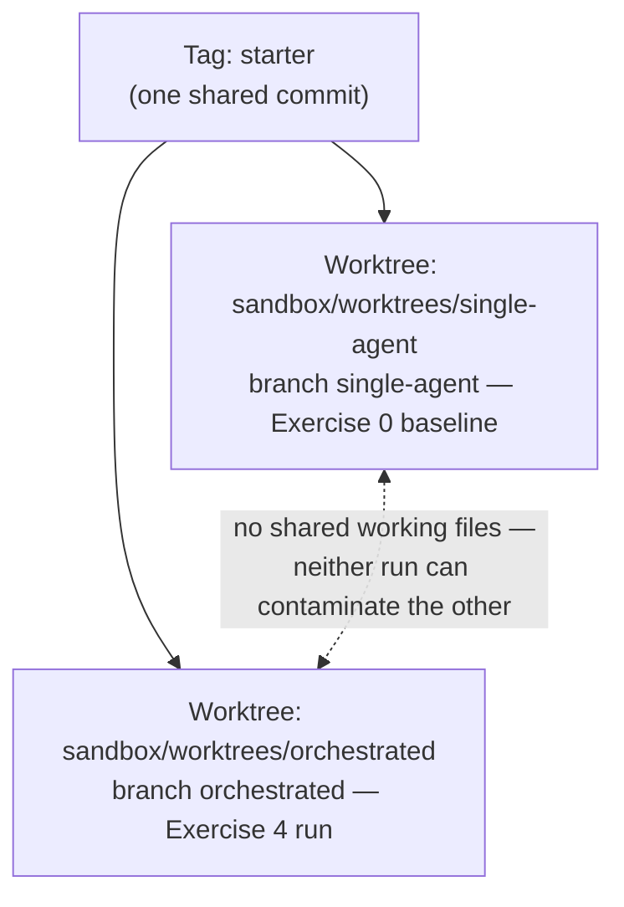

# Module 4 — Micro-lecture 4 + Exercise 4: orchestrated run + matched comparison

**Where you are:** you have cards (module 1), a crew with boundaries (module 2), and an evidence-backed routing decision (module 3). This module puts them together in the same 15-minute window your single agent got in Exercise 0 — same commit, same ticket, same model — and compares honestly.

---

## Micro-lecture 4 — Parallelism is a dependency claim

**Claim: when you run two agents in parallel, you are claiming their tasks don't depend on each other. Parallel-safe work needs a stable interface, independent outputs, and clear ownership.** If the claim is false, you'll pay it back in merge conflicts.

The kitchen version: **three chefs, one cutting board.** Three agents editing `importer.py` isn't parallelism, it's a queue with extra steps and knife injuries. The importer feature *is* genuinely decomposable — but only after Exercise 1's gate: freeze `import_promotions(csv_path, service) -> ImportReport`, then the implementation, the contract tests, and the integration notes have independent outputs and disjoint files.

Three levels of protection — and they are not the same thing:

- **Coordination** — a file-ownership list in each task card ("in scope / out of scope"). Guidance: agents usually honor it, nothing enforces it.
- **Isolation** — Git worktrees and branches. Enforced by the filesystem: two runs that share no working files *cannot* contaminate each other, no matter how badly a prompt goes. Our two worktrees exist precisely so the baseline and orchestrated runs stay clean of each other.
- **Control** — `permission` rules in agent config. Enforced by OpenCode: an agent with `edit: deny` cannot write, whatever it was asked.

Use the cheapest level that actually protects you: coordination for cooperating agents in one checkout, isolation for runs that must stay comparable or safe from each other, control for authority that should never exist in the first place.



*Figure 5 — Worktree isolation: one starter commit, two working directories that cannot touch each other's files.*
Text alternative: a single starter commit branches into two Git worktrees — single-agent for the Exercise 0 baseline and orchestrated for the Exercise 4 run — with an annotation that they share no working files, so neither run can contaminate the other.

> 🔑 **Key takeaway:** A file list in a prompt is coordination; a permission rule is control.

> 📘 **Concept — foreground vs. background delegation**
>
> - **Foreground:** the primary sends a card, then *waits*. Nothing else happens in the parent session until the child reports back. It's like handing a ticket to one station and standing at the pass until the plate arrives.
> - **Background:** the primary sends the card and *keeps working*: it drafts notes, launches another child, answers you. Results arrive when they're ready. That's the pass calling three tickets at once while plating a fourth.
>
> "**Keeping the primary free**" is the goal background delegation serves: the primary (and you) stay available for coordination and judgment instead of blocking on one worker.

One more honest note: in this classroom's pinned setup, delegations run in the **foreground** — background child sessions are experimental in the V1 line; your instructor has a recorded demo. Here, keeping the primary free means *sequencing independent deliverables* and using the gaps between them for your own work (integration notes, diff reading), not simultaneous execution. The orchestration win is in the decomposition and clean integration, not a stopwatch race. (Anthropic reports the same: multi-agent shines on parallelizable exploration; coding has fewer truly parallelizable tasks — [multi-agent research system](https://www.anthropic.com/engineering/multi-agent-research-system), Jun 2025.)

Track ownership in one line per deliverable: *file → owner → card → check.* If two rows share a file, you don't have parallel tasks; you have a fight scheduled for later.

---

## Exercise 4 — Orchestrated run + matched comparison (37 min) 🔨

**Goal:** run the same ticket as Exercise 0 — same commit, same contract, same tests, same model/effort, same 15-minute implementation timebox — but orchestrated. Then compare artifacts honestly.

**Starting checkpoint:**

```bash
cd sandbox/worktrees/orchestrated
git status                                   # clean, branch orchestrated
git log --oneline -1                         # same starter commit as single-agent
python3 -m unittest discover -s tests -v     # ends OK (skipped=9)
mkdir -p .opencode/agents workshop/cards
```

Copy your crew and cards into this worktree. Your agent files and cards were never committed, so they're **untracked**, and untracked files exist only in the folder where you created them (see the [Git primer](README.md#one-time-setup-instructor-runs-this-before-class-you-verify)). This worktree has never seen them:

```bash
cp ../../panic-pantry/.opencode/agents/*.md .opencode/agents/ 2>/dev/null || true
cp ../../panic-pantry/workshop/cards/*.md workshop/cards/ 2>/dev/null || true
opencode
```

If the first copy found nothing, you skipped Exercise 2 — build the crew there first (or ask the instructor for the recovery agents).

**Matched conditions (non-negotiable):** same starter commit ✓ (worktrees), same ticket `tickets/TICKET-001.md` ✓ (in the repo), same acceptance tests ✓ (`tests/test_importer_contract.py`), **same model/effort as your Exercise 0 run** (set it now via `/models`), **15-minute implementation timebox** (instructor calls start/stop; stop even if unfinished).

> 💡 **Field note:** Matched conditions are how you evaluate *any* tooling claim at work — same task, same starting state, same budget, artifacts on both sides. If a vendor demo can't survive that setup, the demo was the product.

### Pre-launch (before the clock starts)

1. Confirm the frozen contract: re-read the acceptance criteria in `tickets/TICKET-001.md`. No task launches until you'd bet a pretzel truck on the interface.
2. Ownership map (from [WRITABLE_FILES.md](../sandbox/panic-pantry/workshop/WRITABLE_FILES.md)):

| Owner | Deliverable | Writable scope |
|---|---|---|
| `@implementer` | importer, per the builder card | `src/panic_pantry/importer.py` only |
| **Breaker**: a subagent the **primary** chooses (Task tool) | tests, per the breaker card | `tests/test_promo_import.py` only |
| **You**, typing yourself or directing the primary agent | integration notes | `workshop/integration-notes.md` only |

**Who will the primary pick as the Breaker?** It reads each subagent's `description` and chooses. Your crew has a reviewer (can't edit) and an implementer (scoped to `importer.py`), so the likeliest pick is the built-in **general** subagent. That's fine, as long as the message it writes keeps your TOUCH line. If it picks `@implementer`, it has handed a test task to an agent whose standing instructions say "importer only." Stop and note it as a routing finding, then re-delegate with a clearer instruction.

3. Set the implementer's model explicitly: add a `model:` line to `.opencode/agents/implementer.md` frontmatter with the exact catalog ID from `/models` — the model your Exercise 3 routing decision assigns to contract-backed implementation work. For the matched comparison this must be the same model/effort as your Exercise 0 run: the model ID *and* the variant you recorded on the Exercise 0 scorecard. Set the session's variant with `ctrl+t` to match. Note the ID and variant in your run record. If you can't confirm a child ran with that exact variant, say so in the record.

### The 15-minute window

Delegate using your Exercise 1 cards — **paste the full card into each delegation** (fresh context!). For example:

```text
@implementer Do exactly what this card says.
[paste workshop/cards/builder.md, full text]
```

For the breaker card, do **not** @-mention anyone. Instead, instruct the primary agent to route it:

```text
Delegate this task card to the appropriate subagent.
[paste workshop/cards/breaker.md, full text]
```

This goes through the **Task tool** (governed by `permission.task`): the primary picks the subagent and spawns the child session itself. Afterwards, walk the session tree (`<Leader>+Down`, Left/Right) and open both children. The implementer's first message is *your* text, word for word. The Breaker's first message is one *the primary wrote*, so check whether it kept your TOUCH and RULES lines. The new tests express the same contract in the Breaker's own words. Between delegations, you draft `workshop/integration-notes.md` yourself or have the primary draft it: what arrived, what was checked, what's still open. Delegations run in the foreground — sequence them; independence of deliverables is what makes the order not matter.

> 🔑 **Key takeaway:** Three chefs, one cutting board is not parallelism — disjoint files are what make the order not matter.

### Integration (inside the window if possible; finish the checks regardless)

```bash
git status                                   # every changed file maps to a card?
git diff                                     # read it — you own this merge
python3 -m unittest discover -s tests -v
```

Then ask your reviewer:

```text
@reviewer Review the current diff of this worktree against tickets/TICKET-001.md.
Policy reminder: discounts above 20% require approval; exactly 20% is active.
Run your checklist: approval bypass, duplicate handling, row reporting, missing tests.
Return findings by severity with file:line citations.
```

### Record the matched comparison (same scorecard as Exercise 0)

Elapsed time, contract tests passing, whole suite, policy handled, interventions, files changed, `opencode stats` token/cost where visible — **plus integration/rework time** (minutes you spent merging, fixing, re-running after delegations returned). A faster patch that needs more cleanup may not be a win. Measure each row the same way as Exercise 0 ([how to fill in each row](module-0-baseline.md#step-2--the-baseline-run-15-min-hard-stop--the-instructor-calls-startstop)) — but from `sandbox/worktrees/orchestrated`, where `git branch --show-current` must print `orchestrated`.

**Required artifacts:** the diff, test output, reviewer findings, `workshop/integration-notes.md`, filled comparison scorecard.

**Acceptance checks:**
- [ ] Contract confirmed frozen before any delegation started.
- [ ] Every changed file maps to exactly one task card; no two writers shared a file (`git status` is the referee).
- [ ] The Breaker's child session was created by the primary (Task tool), not by an @-mention — check the session tree.
- [ ] Full suite run after integration; output captured.
- [ ] Reviewer findings collected and each one dispositioned: **fix** (changed now), **accept** (you judge it's not a problem, with the reason written down), or **defer** (real, not tonight: with a reason and a named owner).
- [ ] Comparison scorecard includes integration/rework time and interprets modestly — one classroom run is a demonstration, not a benchmark.

**Hints (use in order):**
1. Child result off-contract? Don't patch it silently in the parent — send *one* targeted repair delegation citing the exact acceptance check that failed.
2. Breaker stalls? It needs only the contract + `fixtures/promos_messy.expected.md`. It must never read the importer's code. Trim its context.
3. Timebox expiring mid-delegation? Stop anyway. "Unfinished at the same limit" is valid comparison data — that's the point of matched conditions.

**Troubleshooting:**
- Agents missing in the worktree → the `cp` step; agents live per-project in `.opencode/agents/`.
- Weird import errors → stray `__pycache__` (Python caches compiled copies of modules there; a cache left over from a deleted or renamed file can make Python load code that no longer exists); run `bash scripts/reset.sh` **only if** you accept losing the run, or delete `__pycache__` dirs manually.
- Both agents edited the same file → classify it: coordination failure. Serialize, split the contract finer, or isolate — then note it in integration-notes; this is a first-class finding, not an embarrassment.

**Debrief:** Where did orchestration actually pay — coverage, findings, wall-clock, confidence? Where did it cost — tokens, integration time, your attention? On what kind of task in your codebase would the single agent have won?

> 🔑 **Key takeaway:** Parallelism is a dependency claim — if the claim is false, you pay it back in merge conflicts.

---

**Next:** [module-5-capstone.md](module-5-capstone.md) — your agents say "done." Time to hold the receipts.
